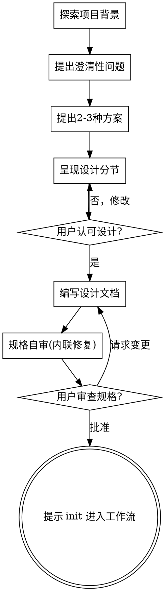

# 将创意头脑风暴成设计

通过自然的协作对话，帮助把想法转化为完整的设计和规格说明。

首先了解当前项目背景，然后逐个提出问题来细化想法。一旦你明确了要构建的内容，就呈现设计并获得用户认可。

<硬性限制>
在你呈现设计并获得用户认可之前，不得调用任何实现技能、编写任何代码、搭建任何项目或采取任何实现行动。这适用于每个项目，无论其看似多么简单。
</硬性限制>

## 反模式：“这太简单了，不需要设计”

每个项目都要经历这个过程。待办事项列表、单功能工具、配置变更——所有项目都是如此。“简单”的项目正是那些未经审视的假设导致最多无用功的地方。设计可以很短（对于真正简单的项目，几句话即可），但你必须呈现它并获得认可。

## 检查清单

你必须为以下每一项创建一个任务，并按顺序完成：

1. **探索项目背景** — 检查文件、文档、最近的提交
2. **提出澄清性问题** — 一次一个，理解目的/约束/成功标准
3. **提出 2-3 种方案** — 附带权衡分析和你的推荐
4. **呈现设计** — 按复杂度分节，每节后获取用户认可
5. **编写设计文档** — 保存到 `docs/superpowers/specs/YYYY-MM-DD-<主题>-design.md` 并提交
6. **规格自审** — 快速内联检查占位符、矛盾、歧义、范围（见下文）
7. **用户审查书面规格** — 在继续之前请用户审查规格文件
8. **交接实现** — 提示用户跑 `/workflow-engine init` 进入工作流（由 workflow-superpower-plan 节点据此设计产出实现计划）

## 流程图

**终态是提示用户 init 进入工作流。** 不要调用任何实现技能。头脑风暴之后不写代码、不搭项目——设计定稿、用户批准后，交给引擎。

## 流程详述

**理解想法：**

- 首先检查当前项目状态（文件、文档、最近的提交）
- 在提出详细问题之前，评估范围：如果请求描述了多个独立的子系统（例如，“构建一个包含聊天、文件存储、计费和分析的平台”），立即指出这个问题。不要花时间细化一个需要首先分解的项目的细节。
- 如果项目太大，单个规格说明无法覆盖，帮助用户分解为子项目：有哪些独立的部分、它们如何关联、应按什么顺序构建？然后通过正常设计流程对第一个子项目进行头脑风暴。每个子项目都有自己的规格 → 计划 → 实现周期。
- 对于范围合适的项目，一次提一个问题来细化想法
- 尽量使用多项选择题，开放式问题也可以
- 每条消息只提一个问题——如果一个主题需要更多探索，拆成多个问题
- 重点理解：目的、约束、成功标准

**探索方案：**

- 提出 2-3 种不同方案及其权衡
- 以对话方式呈现选项，附上你的推荐和理由
- 先给出你推荐的方案并解释原因

**呈现设计：**

- 一旦你认为理解了要构建的内容，就呈现设计
- 每个部分的篇幅与其复杂度匹配：简单的几句话，复杂的最多 200-300 字
- 每部分呈现后询问是否正确
- 涵盖：架构、组件、数据流、错误处理、测试
- 随时准备回头澄清不清楚的地方

**设计隔离性与清晰性：**

- 将系统拆分为更小的单元，每个单元都具有单一明确的目标，通过良好定义的接口进行通信，并且可以独立理解和测试
- 对于每个单元，你应该能够回答：它做什么、如何使用它、它依赖什么？
- 别人能否在不阅读内部实现的情况下理解某个单元的功能？你是否可以修改内部逻辑而不影响其使用者？如果不能，说明边界需要调整
- 更小、边界清晰的单元也更便于你自己处理——你更能推理出能一次性在脑中保持上下文的代码，而当文件专注时，你的编辑会更可靠。当文件变得庞大时，通常意味着它承担了过多的职责

**在现有代码库中工作：**

- 在提出变更之前先探索当前结构，遵循现有模式
- 当现有代码存在问题影响了工作（例如文件过大、边界不清、职责混乱），应将针对性改进纳入设计——就像优秀开发者在工作中改善代码的方式
- 不要提出无关的重构，专注于服务于当前目标

## 设计完成后

**文档编写：**

- 将验证后的设计（规格）写入 `docs/superpowers/specs/YYYY-MM-DD-<主题>-design.md`

**规格自审：**
编写规格文档后，以全新视角审视：

1. **占位符扫描：** 是否存在"TBD"、"TODO"、不完整的章节或含糊不清的需求？修复它们
2. **内部一致性：** 各章节是否存在矛盾？架构是否与功能描述匹配？
3. **范围检查：** 对于单个实施计划而言，范围是否足够聚焦，还是需要进一步分解？
4. **歧义检查：** 是否有任何需求可能被以两种不同方式解读？如果是，选择一种并明确说明

直接修正问题，无需重新审查——修正后继续。

**用户评审关卡：**
规格自审通过后，请用户审阅已写入的规格，然后再继续：

> "规格已编写并提交至 `<路径>`。请审阅，并告知我是否希望在开始进入工作流前做任何修改。"

等待用户回复。如果用户要求修改，进行修改并重新运行规格自审。只有在用户批准后才能继续。

**交接实现：**

设计经用户批准后，不要自行编写实现计划或调用任何实现技能。仅提示用户：

> "设计已定稿并提交。准备好就跑 `/workflow-engine init <task>` 进入工作流——首个节点 workflow-superpower-plan 会据此设计产出实现计划。"

## 关键原则

- **一次只问一个问题** - 不要用多个问题让人应接不暇
- **首选多项选择** - 在可能的情况下，比开放性问题更容易回答
- **严格遵循 YAGNI** - 从所有设计中移除不必要的功能
- **探索替代方案** - 在确定方案前总是提出 2-3 种方法
- **逐步验证** - 先展示设计，获得批准后再继续
- **保持灵活** - 当某些内容不太清楚时，回头澄清
