# 【PRD】劳动者任务系统

**文档修订记录**

| **版本** | **内容** | **作者** | **日期** |
| --- | --- | --- | --- |
| V0.1 | 新建 | XX | 2024/8/1 |

# **一、概述**

- 1\. **背景：**

当前平台对劳动者的激励依赖人工统计与线下发放，存在以下核心痛点：

- **激励不及时**：奖励核算周期长，劳动者感知弱，激励效果衰减
- **配置不灵活**：同一城市同一类型活动无法并行，无法满足精细化运营需求（如同时做"全勤奖"和"周末加码奖"）
- **过程不可见**：劳动者无法实时查看任务进度，达成与否缺乏即时反馈
- **人群管理粗放**：无法灵活圈选目标人群，名单依赖人工管控，数据依赖程度高
- 1\. **收益**
- 配合劳动者等级3.0，**劳动者结算时薪下降0.6元/h**
- 丰富劳动者收入构成，多样化激励引导服务积极性，并可降低人均成本支出 元/月，全年共计
- 2\. **运营计划**

期望上线时间：2026年9月中

# **二、功能需求**

## 2.1 功能列表

| **功能模块** | **子功能点** | **调整类型** |
| --- | --- | --- |
| Man端 | 任务管理 | 新增 |
|   | 任务创建 | 新增 |
|   | 计费对账 | 修改 |
| 京家政 | 任务中心、任务卡片、任务详情 | 新增 |

## 2.2 **【man端】**

**任务状态流程图**

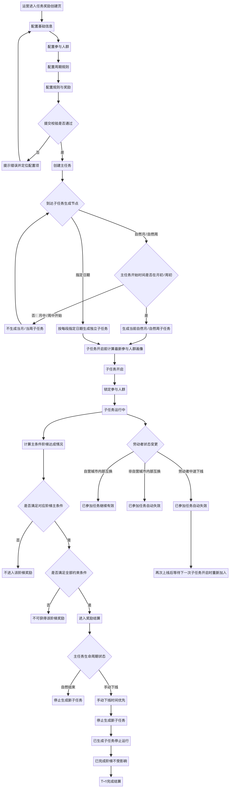

### 2.2.1 商家奖励管理菜单

| **序号** | **模块** | **示意图** | **需求详述** | **备注** |
| --- | --- | --- | --- | --- |
| 1 | 商家奖励管理 | 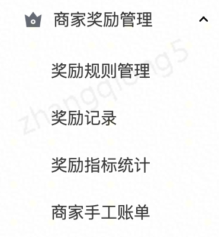 | 原【商家奖励管理】菜单内各菜单改名，，并新增【**任务管理**】菜单 <table><colgroup><col style="width:50px"><col style="width:50px"><col style="width:133px"><col style="width:168px"><col style="width:141px"></colgroup><tr><td style="background-color:#F5F5F5">
<strong>菜单等级</strong>
</td><td style="background-color:#F5F5F5">
&nbsp;
</td><td style="background-color:#F5F5F5">
<strong>原名称</strong>
</td><td style="background-color:#F5F5F5">
<strong>新名称</strong>
</td><td style="background-color:#F5F5F5">
<strong>备注</strong>
</td></tr><tr><td>
一级
</td><td>
&nbsp;
</td><td>
商家奖励管理
</td><td>
任务奖励管理
</td><td>
&nbsp;
</td></tr><tr><td>
&nbsp;
</td><td>
二级
</td><td>
/
</td><td>
任务管理
</td><td>
新增
</td></tr><tr><td>
&nbsp;
</td><td>
&nbsp;
</td><td>
奖励规则管理
</td><td>
荣誉规则管理
</td><td>
&nbsp;
</td></tr><tr><td>
&nbsp;
</td><td>
&nbsp;
</td><td>
奖励记录
</td><td>
荣誉记录
</td><td>
&nbsp;
</td></tr><tr><td>
&nbsp;
</td><td>
&nbsp;
</td><td>
奖励指标统计
</td><td>
&nbsp;
</td><td>
无用，已下线
</td></tr><tr><td>
&nbsp;
</td><td>
&nbsp;
</td><td>
商家手工账单
</td><td>
商家手工账单
</td><td>
&nbsp;
</td></tr></table> |   |

### 2.2.2 任务奖励管理-任务列表

| **序号** | **模块** | **示意图** | **需求详述** | **备注** |
| --- | --- | --- | --- | --- |
| 1 | 【任务奖励管理】-【任务管理】 | 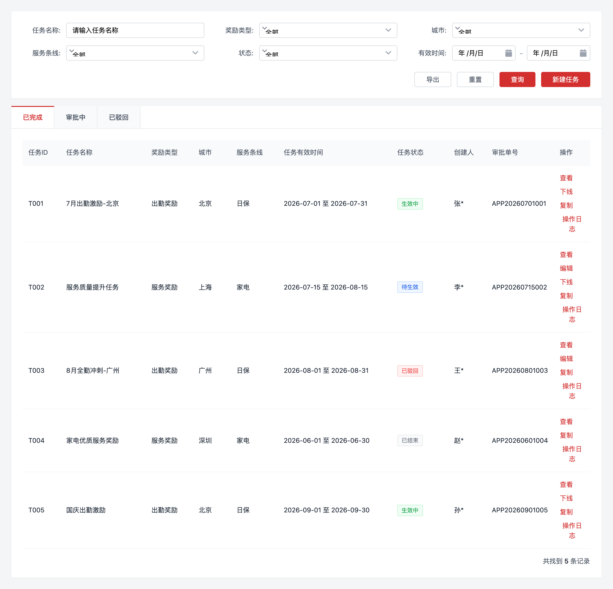 | 1. **任务查询 ** <table><colgroup><col style="width:108px"><col style="width:141px"><col style="width:87px"><col style="width:68px"><col style="width:300px"></colgroup><tr><td style="background-color:#F5F5F5">
<strong>筛选条件</strong>
</td><td style="background-color:#F5F5F5">
<strong>类型</strong>
</td><td style="background-color:#F5F5F5">
<strong>是否必填</strong>
</td><td style="background-color:#F5F5F5">
<strong>是否支持多选</strong>
</td><td style="background-color:#F5F5F5">
<strong>说明/枚举</strong>
</td></tr><tr><td>
任务名称
</td><td>
输入框
</td><td>
否
</td><td>
/
</td><td>
支持模糊查询
</td></tr><tr><td>
奖励类型
</td><td>
下拉选择
</td><td>
否
</td><td>
否
</td><td>
枚举如出勤奖、服务奖等，以系统配置为准
</td></tr><tr><td>
城市
</td><td>
选择器
</td><td>
否
</td><td>
是
</td><td>
支持按已开城城市筛选
</td></tr><tr><td>
服务条线
</td><td>
下拉选择
</td><td>
否
</td><td>
否
</td><td>
日保、家电
</td></tr><tr><td>
<s>任务状态</s>
</td><td>
<s>下拉选择</s>
</td><td>
<s>否</s>
</td><td>
<s>否</s>
</td><td>
<s>待生效、生效中、已结束、已下线、已驳回</s>

&nbsp;
</td></tr><tr><td>
任务有效时间
</td><td>
日期范围
</td><td>
否
</td><td>
否
</td><td>
查询任务整体开始时间和结束时间范围
</td></tr><tr><td>
经营模式
</td><td>
下拉选择
</td><td>
否
</td><td>
否
</td><td>
自营/加盟
</td></tr></table> 1. **任务列表** &nbsp;&nbsp;&nbsp;&nbsp;a. 列表表头 <table><colgroup><col style="width:124px"><col style="width:422px"></colgroup><tr><td style="background-color:#F5F5F5">
<strong>字段</strong>
</td><td style="background-color:#F5F5F5">
<strong>说明</strong>
</td></tr><tr><td>
任务ID
</td><td>
&nbsp;
</td></tr><tr><td>
任务名称
</td><td>
创建任务时填写的名称（对内）
</td></tr><tr><td>
奖励类型
</td><td>
当前任务配置的奖励类型
</td></tr><tr><td>
城市
</td><td>
任务城市/自营/加盟
</td></tr><tr><td>
服务条线
</td><td>
日保、家电
</td></tr><tr><td>
任务有效时间
</td><td>
主任务开始时间至结束时间
</td></tr><tr><td>
<s>任务状态</s>
</td><td>
<s>待生效、生效中、已结束、已下线、已驳回</s>
</td></tr><tr><td>
创建人
</td><td>
创建任务的账号erp或pin
</td></tr><tr><td>
审批单号
</td><td>
触发审批展示单号
</td></tr><tr><td>
操作
</td><td>
查看、编辑、下线、复制、操作日志
</td></tr></table> &nbsp;&nbsp;&nbsp;&nbsp;a. 任务状态tab <table><colgroup><col style="width:133px"><col style="width:333px"><col style="width:252px"><col style="width:61px"></colgroup><tr><td style="background-color:#F5F5F5">
<strong>枚举（主状态）</strong>
</td><td style="background-color:#F5F5F5">
<strong>状态说明</strong>
</td><td style="background-color:#F5F5F5">
<strong>展示按钮</strong>
</td><td style="background-color:#F5F5F5">
<strong>备注</strong>
</td></tr><tr><td>
待生效
</td><td>
任务完成创建后，未到达生效时间
</td><td>
查看、编辑、下线、复制、操作日志、下载
</td><td>
&nbsp;
</td></tr><tr><td>
生效中
</td><td>
任务到达生效时间，未到达失效时间
</td><td>
查看、下线、复制、操作日志、下载
</td><td>
&nbsp;
</td></tr><tr><td>
已结束
</td><td>
任务生效后自然到达失效时间，中途未操作下线
</td><td>
查看、复制、操作日志、下载
</td><td>
&nbsp;
</td></tr><tr><td>
已下线
</td><td>
任务完成创建后，中途操作下线
</td><td>
查看、复制、操作日志、下载
</td><td>
&nbsp;
</td></tr><tr><td>
已驳回
</td><td>
任务完成创建后，在审批中被驳回
<ol class="ol-normal ol-level-0"><li>审批被驳回进入已驳回</li><li>若修改的这一条被驳回，不影响原来的任务规则，审批完成的会覆盖原有的</li></ol></td><td>
查看、复制、操作日志<s>、下载</s>
</td><td>
&nbsp;
</td></tr><tr><td>
审批中
</td><td><ol class="ol-normal ol-level-0"><li>有3种情况会触发审批：新建提交后、待生效编辑任务内容后、生效中申请下线后</li><li>未完成审批时在此tab展示</li></ol></td><td>
查看、复制、操作日志<s>、下载</s>
</td><td>
&nbsp;
</td></tr></table> &nbsp;&nbsp;&nbsp;&nbsp;a. 操作按钮 <table><colgroup><col style="width:100px"><col style="width:587px"><col style="width:100px"></colgroup><tr><td style="background-color:#F5F5F5">
<strong>按钮</strong>
</td><td style="background-color:#F5F5F5">
<strong>说明</strong>
</td><td style="background-color:#F5F5F5">
<strong>备注</strong>
</td></tr><tr><td>
查看
</td><td>
查看任务创建时信息
</td><td>
&nbsp;
</td></tr><tr><td>
编辑
</td><td><ol class="ol-normal ol-level-0"><li>按钮需增加权限控制</li><li>任务生效后只允许编辑白名单追加参与人群</li><ol class="ol-normal ol-level-1"><li>只支持添加</li><li>按照最新的全量名单上传excel@管磊</li><li>文案提醒：白名单导入人群时请上传全量文件，数据以最新文件为准</li></ol><li>在任务创建后、到达生效时间前支持编辑任务中的全部内容，提交后触发审批</li><ol class="ol-normal ol-level-1"><li>审批中的不允许再次修改，提示已有正在审批中的任务</li></ol></ol></td><td>
&nbsp;
</td></tr><tr><td>
下线
</td><td><ol class="ol-normal ol-level-0"><li>按钮需增加权限控制</li><li>点击下线选择任务下线时间，下线时间最早选择操作当天，最晚选择任务结束时间，时间为所选日期的23:00:00</li><li>对待生效任务操作下线时，无需审批</li><li>对生效中任务操作下线时，需要触发下线审批</li><ol class="ol-normal ol-level-1"><li>审批流的通过时间早于选择的下线时间，审批完成后以下线时间为准</li><li>审批流的通过时间晚于选择的下线时间，审批完成立即执行</li></ol><li>操作下线时需要校验生效中的子任务时间，任务下线时间早于子任务结束时间时，子任务停止运行，向劳动者展示失效，不影响已经完成的阶梯结算</li></ol></td><td>
&nbsp;
</td></tr><tr><td>
复制
</td><td><ol class="ol-normal ol-level-0"><li>按钮需增加权限控制</li><li>点击打开一个任务创建窗口，复制原任务的大部分内容，清空任务名称、任务起止时间，需要新打开页签，不在原列表页上前进 </li></ol></td><td>
&nbsp;
</td></tr><tr><td>
操作日志
</td><td>
记录任务新建、编辑、审批等各个节点的操作和改动
</td><td>
&nbsp;
</td></tr><tr><td>
新建任务
</td><td><ol class="ol-normal ol-level-0"><li>按钮需增加权限控制</li><li>点击打开一个空白的任务创建窗口，需要新打开页签，不在原列表页上前进</li></ol></td><td>
&nbsp;
</td></tr><tr><td>
导出
</td><td><ol class="ol-normal ol-level-0"><li>按钮支持下载主任务明细</li></ol>

<ol class="ol-normal ol-level-1"><li>按钮需增加权限配置</li><li>上限x条</li><li>格式：excel</li><li>导出信息除了表头还需要加任务里的所有信息（人群标签也要，白名单就不要了）@管磊提供模版</li></ol></td><td>
&nbsp;
</td></tr><tr><td>
下载
</td><td>

<ol class="ol-normal ol-level-0"><li>支持下载子任务及人群数量信息</li><ol class="ol-normal ol-level-1"><li>格式：excel</li><li>按钮需增加权限配置</li></ol></ol></td><td>
&nbsp;
</td></tr></table> |   |

### 2.2.3 任务新建/编辑

| **序号** | **模块** | 示意图 | **需求详述** | **备注** |
| --- | --- | --- | --- | --- |
| 1 | 任务创建全页面 | 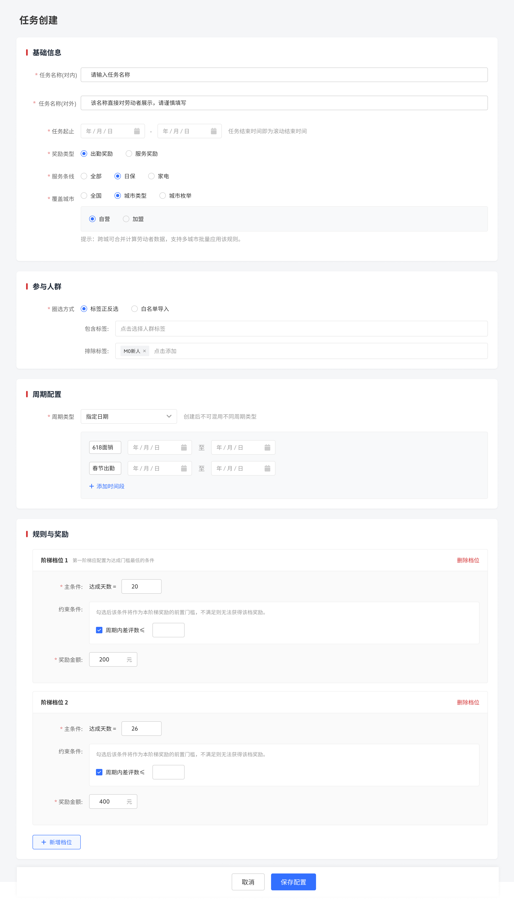 | 1. 包含基础信息、参与人群、周期配置、规则与奖励模块 2. 全部完成后提交保存 |   |
| 2 | 基础信息模块 | 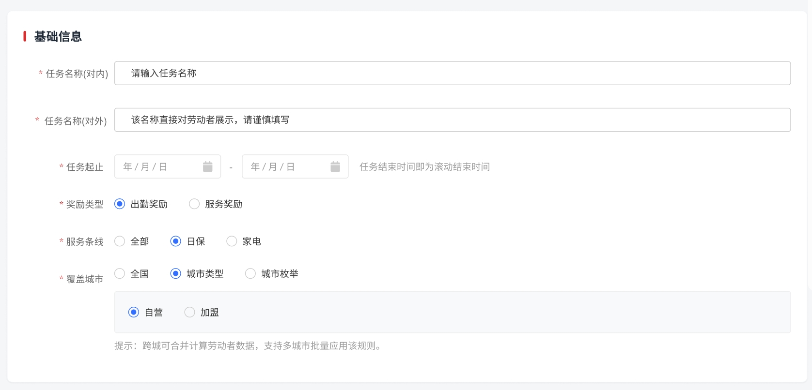 | 1. ~~一个城市的任务类型是否要去重，是否要卡控   唯一标识~~ ~~同一时间同一个城市同一个类型同一个条线做卡控~~ 1. 任务名称（对内）：支持输入一定长度的文本，40字符 2. 对外名称：支持输入一定长度的文本，30字符，暗纹提示“该名称直接对劳动者展示，请谨慎填写” 3. 任务起止 &nbsp;&nbsp;&nbsp;&nbsp;a. 标识整个大任务开始和最终结束的时间，一个大任务中可能包含多个子任务 &nbsp;&nbsp;&nbsp;&nbsp;b. 任务自然结束后，~~已经生成的子任务持续运行&结算，~~停止生成新的子任务 &nbsp;&nbsp;&nbsp;&nbsp;&nbsp;&nbsp;&nbsp;&nbsp;i. **如果选择自然周自动循环，任务结束时间校验只允许选择每周最后一天；如果是自然月，则是每个月倒数第二天** &nbsp;&nbsp;&nbsp;&nbsp;&nbsp;&nbsp;&nbsp;&nbsp;&nbsp;&nbsp;&nbsp;&nbsp;1. 保存的时候校验 &nbsp;&nbsp;&nbsp;&nbsp;&nbsp;&nbsp;&nbsp;&nbsp;ii. **如果选择自然月/自然周自动循环，开始时间为月中或者周中的时候，不生成当月或者当周子任务** &nbsp;&nbsp;&nbsp;&nbsp;&nbsp;&nbsp;&nbsp;&nbsp;&nbsp;&nbsp;&nbsp;&nbsp;1. 循环选择不开启的时候，生成的开始时间为周/月的起始日，结束时间校验为周的最后一天，月的倒数第二天 &nbsp;&nbsp;&nbsp;&nbsp;&nbsp;&nbsp;&nbsp;&nbsp;&nbsp;&nbsp;&nbsp;&nbsp;2. 循环周场景，第x周根据周三作为切割日期来计算 &nbsp;&nbsp;&nbsp;&nbsp;&nbsp;&nbsp;&nbsp;&nbsp;&nbsp;&nbsp;&nbsp;&nbsp;&nbsp;&nbsp;&nbsp;&nbsp;1. 举例：1号在周三及之前的，算新月份第一周，其他情况下算上个月最后一周 &nbsp;&nbsp;&nbsp;&nbsp;c. 任务下线时，已经生成的子任务停止运行，不影响已完成阶梯的结算，停止生成新的子任务 &nbsp;&nbsp;&nbsp;&nbsp;&nbsp;&nbsp;&nbsp;&nbsp;i. 结算T\+1完成 4. 奖励类型：本期枚举出勤奖励、服务奖励，不同奖励类型对应不同的规则奖励设置 5. 服务条线：日保/家电/全部。当选择日保/家电时，该任务仅对该条线下的劳动者生效和展示（参与人群画像圈选，前置硬性过滤）@张振鑫 aunt\_info  -\> service\_line\_type 6. 覆盖城市（参与人群画像圈选，前置硬性过滤） &nbsp;&nbsp;&nbsp;&nbsp;a. 全国：全部已开城城市， 包含自营和加盟 &nbsp;&nbsp;&nbsp;&nbsp;b. 城市类型：自营、加盟 &nbsp;&nbsp;&nbsp;&nbsp;c. 城市枚举：支持城市多选，需要支持搜索 &nbsp;&nbsp;&nbsp;&nbsp;d. 筛选城市的时候，需校验用户的权限 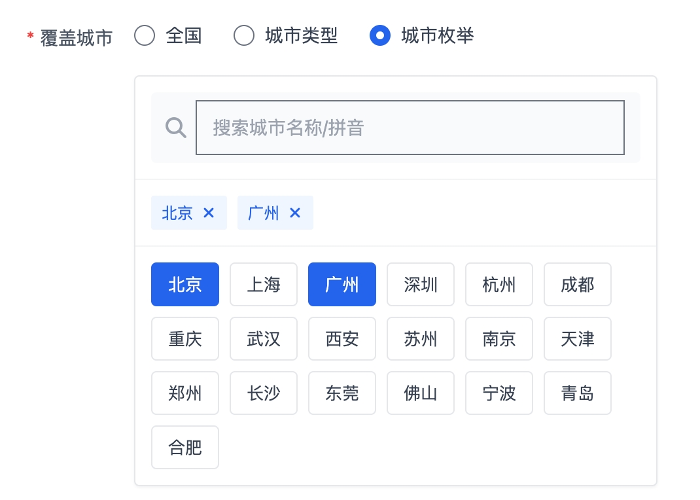 |   |
| 2 | 参与人群 | 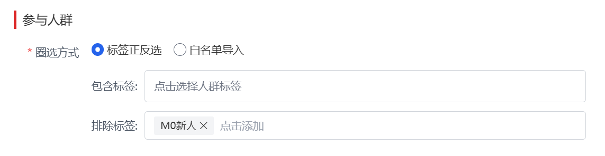 | 1. 支持通过标签人群圈选和白名单导入两种方式圈定任务参与人群 &nbsp;&nbsp;&nbsp;&nbsp;a. 两种方式互斥 2. 标签圈选 &nbsp;&nbsp;&nbsp;&nbsp;a. 需要支持正反选，正反选均支持标签多选 &nbsp;&nbsp;&nbsp;&nbsp;b. 正选：选取对应标签的劳动者，取并集 &nbsp;&nbsp;&nbsp;&nbsp;c. 反选：从正选结果中剔除反选标签下的劳动者，即先取反选并集，再剔除正反选结果的交集 &nbsp;&nbsp;&nbsp;&nbsp;d. 标签数据可同数据组沟通提供方式，T\+1更新 &nbsp;&nbsp;&nbsp;&nbsp;e. 人群同一个标签不能同时支持正选和反选 &nbsp;&nbsp;&nbsp;&nbsp;f. 选完人群标签后展示圈选的人数 3. 标签列表 &nbsp;&nbsp;&nbsp;&nbsp;a. 纯新人：上线30天（为首次上线） &nbsp;&nbsp;&nbsp;&nbsp;b. 次新人：上线30天（为非首次上线） &nbsp;&nbsp;&nbsp;&nbsp;c. 带教师傅：勾选带教师傅标签 &nbsp;&nbsp;&nbsp;&nbsp;d. 组长：在小组管理中担任组长 &nbsp;&nbsp;&nbsp;&nbsp;e. O序列：是京东员工 &nbsp;&nbsp;&nbsp;&nbsp;f. 党员：是党员（表名@张振鑫） aunt\_info\_extend -\> party\_member &nbsp;&nbsp;&nbsp;&nbsp;g. 劳动者等级：按照等级1-5设置不同标签，与1星2星/黄金白银无关，取当月等级 &nbsp;&nbsp;&nbsp;&nbsp;&nbsp;&nbsp;&nbsp;&nbsp;i. 运营选择人群标签，选择等级相关标签时，提示：等级每月初刷新，配置自然月周期时可能存在等级数据未更新的问题。 &nbsp;&nbsp;&nbsp;&nbsp;&nbsp;&nbsp;&nbsp;&nbsp;ii. **数据范围：t\+1更新，城市\(类型 \+ 城市id\)\+服务条线全量在线劳动者等级信息** 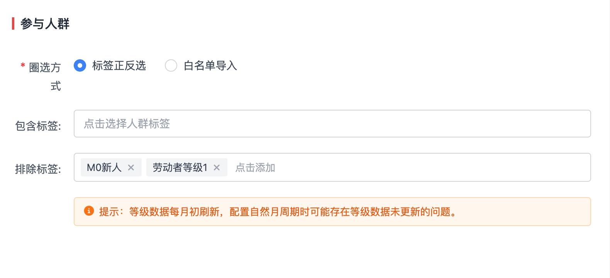 1. 任务人群动态刷新 &nbsp;&nbsp;&nbsp;&nbsp;a. 每个子任务开启前，根据最新的数据计算任务参与人群画像，子任务开启后参与人群锁定，不再更新 举例：开启自动循环的自然月任务，在每个子任务（每个月1号）开启前，系统会基于最新的标签画像重新计算并锁定当前子任务的参与人群 1. 白名单导入 &nbsp;&nbsp;&nbsp;&nbsp;a. 通过excel上传劳动者ID，单个文件最多Xw条，若上传文件中的数据超过Xw条，系统阻断上传并提示‘超过最大导入数量’，不进行部分截断导入；超过可拆分为多个文件进行上传 &nbsp;&nbsp;&nbsp;&nbsp;b. 若白名单中劳动者与前置硬性过滤条件（**服务条线、城市）**不匹配，该部分劳动者导入失败，toast提醒并支持下载上传结果，上传结果中展示是否上传成功及失败原因 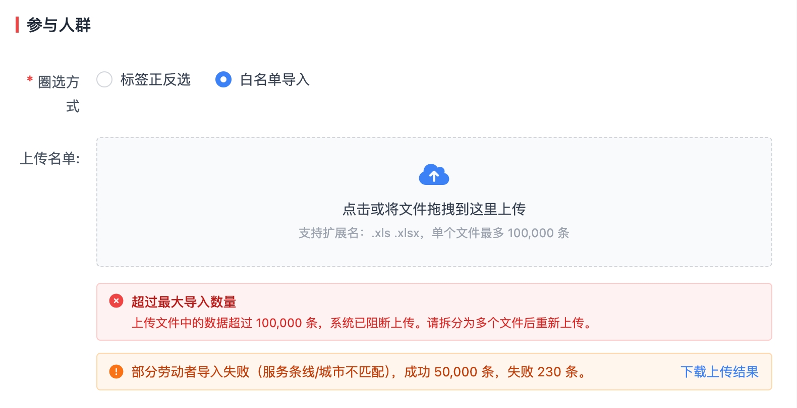 1. 本期任务仅针对已上线状态的劳动者生效，未上线、已下线劳动者不可参与 2. 单个任务最多命中10w劳动者，超过该数量在提交时进行相关提醒 &nbsp;&nbsp;&nbsp;&nbsp;a. 提示：单个任务最多命中10w劳动者，目前已超过该数量 &nbsp;&nbsp;&nbsp;&nbsp;b. 每个表格限制上限xxx条 |   |
| 3 | 周期配置 | <table><colgroup><col style="width:198px"></colgroup><tr><td>

</td></tr><tr><td>

</td></tr></table> | 1. 配置子任务的生效时间和循环规则，支持以下3类3种配置 <table><colgroup><col style="width:74px"><col style="width:71px"><col style="width:156px"><col style="width:316px"><col style="width:84px"></colgroup><tr><td style="background-color:#F5F5F5">
<strong>类型</strong>
</td><td style="background-color:#F5F5F5">
<strong>枚举</strong>
</td><td style="background-color:#F5F5F5">
<strong>适用场景</strong>
</td><td style="background-color:#F5F5F5">
<strong>配置内容</strong>
</td><td style="background-color:#F5F5F5">
<strong>备注</strong>
</td></tr><tr><td>
周期滚动
</td><td>
自然月
</td><td>
每周/每月都有，长期循环产生的任务，如：每月出勤
</td><td><ol class="ol-normal ol-level-0"><li><s>开始日期：仅支持选择每月1日或每周一，结束时间自动匹配自然月和自然周的最后一天</s></li><li>是否开启自动循环：若开启，则每个月初和周初自动滚动生成新的子任务，若不开启，则只在开始日期的当月/周生成子任务</li></ol></td><td>
&nbsp;
</td></tr><tr><td>
&nbsp;
</td><td>
自然周
</td><td>
&nbsp;
</td><td>
&nbsp;
</td><td>
&nbsp;
</td></tr><tr><td>
指定日期
</td><td>
指定日期
</td><td>
特定日期任务。如：618面销、春节出勤
</td><td><ol class="ol-normal ol-level-0"><li>开始日期和结束日期</li><li>支持配置多段时间，每段时间为独立子任务</li><li>指定日期必须在主任务时间范围内且子任务之间不允许交叉</li><li>指定日期不支持自动循环</li><li>任务名称非必填</li></ol></td><td>
&nbsp;
</td></tr></table> 1. 若运营中途执行了“手动下线”，手动下线时间优先级高于自动匹配时间 |   |
| 4 | 规则奖励 | 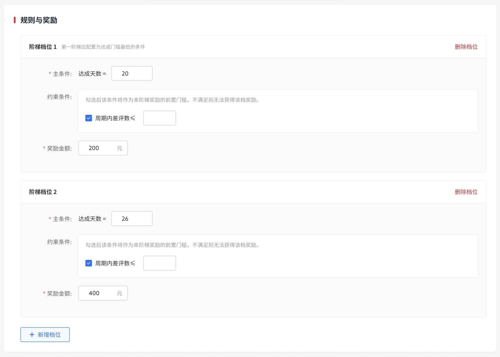 | 1. 根据基础信息里的任务奖励类型带出对应的奖励规则，不同类型的任务主条件与约束条件不同 2. 主条件 &nbsp;&nbsp;&nbsp;&nbsp;a. 必填 &nbsp;&nbsp;&nbsp;&nbsp;b. 支持创建多个阶梯，阶梯上限3个，达到条件后发放对应档位奖励 &nbsp;&nbsp;&nbsp;&nbsp;c. 阶梯名称不支持编辑 &nbsp;&nbsp;&nbsp;&nbsp;d. 阶梯为递进关系，业务把控@管磊 &nbsp;&nbsp;&nbsp;&nbsp;e. 阶梯档位一文案提示：第一阶梯应配置为达成门槛最低的条件 3. 约束条件 &nbsp;&nbsp;&nbsp;&nbsp;a. 非必填，附属于主条件，不独立存在 &nbsp;&nbsp;&nbsp;&nbsp;b. 不作为达成阶梯的目标条件，但不满足约束条件就不可获得该奖励 &nbsp;&nbsp;&nbsp;&nbsp;c. 当存在多个约束条件时，只有满足每个约束条件，才能获得对应奖励 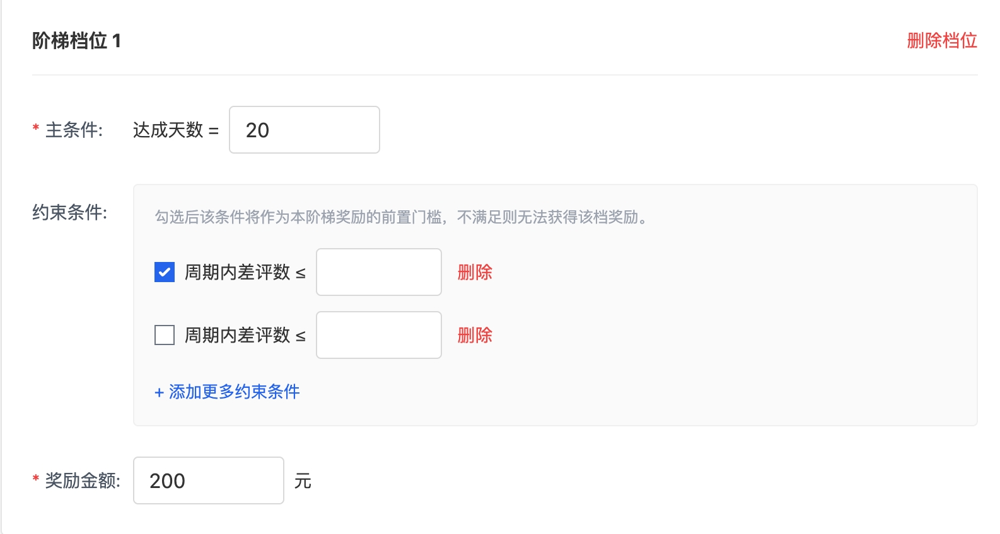 1. 本期奖励内容只有现金奖励，单位为rmb元，支持小数点后一位数 &nbsp;&nbsp;&nbsp;&nbsp;a. 上限xx元@管磊 <table><colgroup><col style="width:123px"><col style="width:154px"><col style="width:116px"><col style="width:315px"></colgroup><tr><td style="background-color:#F5F5F5">
<strong>任务奖励类型</strong>
</td><td style="background-color:#F5F5F5">
<strong>主条件</strong>
</td><td style="background-color:#F5F5F5">
<strong>约束条件</strong>
</td><td style="background-color:#F5F5F5">
<strong>备注</strong>
</td></tr><tr><td>
出勤奖励
</td><td>
出勤天数

&gt;=
</td><td>
差评数量

&lt;=

&nbsp;
</td><td>
出勤满足20天，但差评统计的是自然月内的差评，阶梯奖励需要在本月结束后判断发放
</td></tr><tr><td>
服务奖励
</td><td>
差评数量

&lt;=
</td><td>
出勤天数

&gt;=
</td><td>
&nbsp;
</td></tr><tr><td>
&nbsp;
</td><td>
&nbsp;
</td><td>
服务单量

&gt;=
</td><td>
&nbsp;
</td></tr></table> |   |

### 2.2.4 任务规则说明

| **序号** | **模块** | **需求详述** | **备注** |
| --- | --- | --- | --- |
| 1 | 任务中劳动者换城市及劳动者下线 | 1. 劳动者换城 &nbsp;&nbsp;&nbsp;&nbsp;a. 劳动者换城时，如果是自营城市内部互换，已经参加的任务可以继续参加； &nbsp;&nbsp;&nbsp;&nbsp;b. 非以上情况的，已经参加的任务自动失效 &nbsp;&nbsp;&nbsp;&nbsp;&nbsp;&nbsp;&nbsp;&nbsp;i. 加盟换自营，自营换加盟 &nbsp;&nbsp;&nbsp;&nbsp;&nbsp;&nbsp;&nbsp;&nbsp;ii. 加盟换加盟 &nbsp;&nbsp;&nbsp;&nbsp;&nbsp;&nbsp;&nbsp;&nbsp;iii. 失效后之前的任务t\+1结钱，订单、出勤、差评等统计不具备城市属性，不影响数据统计 &nbsp;&nbsp;&nbsp;&nbsp;&nbsp;&nbsp;&nbsp;&nbsp;iv. 目前运营可在man端修改城市是否为自营 2. 劳动者中途下线 &nbsp;&nbsp;&nbsp;&nbsp;a. 已经参加的任务自动失效 &nbsp;&nbsp;&nbsp;&nbsp;b. 失效后之前的任务t\+1结钱 &nbsp;&nbsp;&nbsp;&nbsp;c. 再次上线之后根据下一次子任务开启时再加入 |   |
| 2 | 审批流及提醒 | 1. 新建、编辑任务时，根据任务服务条线触发对应审批流： 2. @管磊提供需要的字段 服务条线为日保时： 服务条线为家电时： 服务条线为全部时： 1. 下线任务时，触发审批流： 2. 任务即将到期时，发送以下提醒： &nbsp;&nbsp;&nbsp;&nbsp;a. 给运营发咚咚通知，xxx任务即将到期，请尽快处理 &nbsp;&nbsp;&nbsp;&nbsp;b. 提前15天/7天 |   |
| 3 | 奖励发放规则 | 1. 各阶梯档位彼此独立计算，达到档位目标即发放对应阶梯奖励。举例： &nbsp;&nbsp;&nbsp;&nbsp;a. 出勤奖励分2档，出勤20天奖励200元，出勤26天奖励200元 &nbsp;&nbsp;&nbsp;&nbsp;b. 配置时第一阶梯条件为出勤20天奖励200元，第二阶梯条件为出勤26天奖励200元，满足出勤26天的劳动者发放200\+200元 2. 数据统计与奖励发放规则 &nbsp;&nbsp;&nbsp;&nbsp;a. 数据T\+1更新：当天出勤完次日更新，当天有差评次日更新 &nbsp;&nbsp;&nbsp;&nbsp;b. 自然月任务统计每月往前顺延一天，即统计上月最后一天到本月倒数第二天，在每月最后一天出任务结果和计费，跟随本月账单进行合账 &nbsp;&nbsp;&nbsp;&nbsp;&nbsp;&nbsp;&nbsp;&nbsp;i. 如有异常情况延迟，算下月 &nbsp;&nbsp;&nbsp;&nbsp;c. 任务达成T\+1进行奖励发放，期望**6月自然月的任务奖励，在7月15号可提现。** |   |
| 4 | 数据指标@贾瑞强 | 1. 涉及到单量、差评数量的，仅统计对应服务条线下的订单产生的主单量（**补充订单不算、加项不算-同数据现成逻辑）**和评价 &nbsp;&nbsp;&nbsp;&nbsp;a. 差评统计以子任务时间内发生为准，不考虑订单服务时间 &nbsp;&nbsp;&nbsp;&nbsp;b. 仅统计任务对应条线的订单，日保任务仅统计日保条线订单 &nbsp;&nbsp;&nbsp;&nbsp;c. 日保和家电条线任务的差评，分别只统计A品和B品的订单（后续如有变更会同步数据侧更改，业务侧未同步则不计入对应订单） &nbsp;&nbsp;&nbsp;&nbsp;&nbsp;&nbsp;&nbsp;&nbsp;i. A品：A品包含日常保洁、玻璃清洗、厨房重油污专区清洁、春节全屋扫除、大闸蟹拆蟹、宠居除毛深度清洁、宠物上门喂养、上门遛狗喂养（北京）、JKC洗车（北京） &nbsp;&nbsp;&nbsp;&nbsp;&nbsp;&nbsp;&nbsp;&nbsp;ii. B品： [📎 **家电服务类型.xlsx** · 11.5 KB](【PRD】劳动者任务系统_attachments/家电服务类型.xlsx) 1. 差评：按照评价时间计算 2. 服务单量：按照服务完成时间计算服务单量，需校验上户卡，下户卡无需卡控 3. 出勤：按照任务下线时间计算劳动者出勤时长，当天出勤时长＞10h记为出勤一天 4. 标签列表 &nbsp;&nbsp;&nbsp;&nbsp;a. 纯新人：上线30天（为首次上线） &nbsp;&nbsp;&nbsp;&nbsp;b. 次新人：上线30天（为非首次上线） &nbsp;&nbsp;&nbsp;&nbsp;c. 带教师傅：勾选带教师傅标签 &nbsp;&nbsp;&nbsp;&nbsp;d. 组长：在小组管理中担任组长 &nbsp;&nbsp;&nbsp;&nbsp;e. O序列：是京东员工 &nbsp;&nbsp;&nbsp;&nbsp;f. 党员：是党员（表名@张振鑫） aunt\_info\_extend -\> party\_member &nbsp;&nbsp;&nbsp;&nbsp;g. 劳动者等级：按照等级1-5设置不同标签，与1星2星/黄金白银无关，取当月等级 &nbsp;&nbsp;&nbsp;&nbsp;&nbsp;&nbsp;&nbsp;&nbsp;i. 运营选择人群标签，选择等级相关标签时，提示：等级每月初刷新，配置自然月周期时可能存在等级数据未更新的问题。 &nbsp;&nbsp;&nbsp;&nbsp;&nbsp;&nbsp;&nbsp;&nbsp;ii. **数据范围：t\+1更新，城市\(类型 \+ 城市id\)\+服务条线全量在线劳动者等级信息** |   |

### 2.2.5 计费对账@徐天赐

| **序号** | **模块** | **示意图** | **需求详述** | **备注** |
| --- | --- | --- | --- | --- |
| 1 | 【计费对账】-【商家收入明细】 | 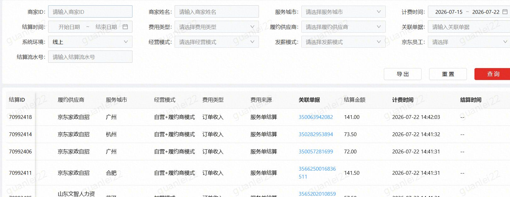 | 1. 展示任务系统产生的劳动者收入费用 &nbsp;&nbsp;&nbsp;&nbsp;a. 新增费项，费用类型为奖励收入 &nbsp;&nbsp;&nbsp;&nbsp;b. 费用来源取任务类型 &nbsp;&nbsp;&nbsp;&nbsp;&nbsp;&nbsp;&nbsp;&nbsp;i. 出勤奖励 &nbsp;&nbsp;&nbsp;&nbsp;&nbsp;&nbsp;&nbsp;&nbsp;ii. 服务奖励 2. 增加【费用来源】筛选项 &nbsp;&nbsp;&nbsp;&nbsp;a. 计费提供查询接口 | &nbsp;&nbsp;&nbsp;&nbsp;a. 出勤奖励和服务奖励都属于成本 &nbsp;&nbsp;&nbsp;&nbsp;b. 关联单据关联任务ID &nbsp;&nbsp;&nbsp;&nbsp;&nbsp;&nbsp;&nbsp;&nbsp;i. 需要拼一下   &nbsp;&nbsp;&nbsp;&nbsp;&nbsp;&nbsp;&nbsp;&nbsp;ii. 可跳转任务id详情页 |
| 2 | 【我的收入】-收入明细 | 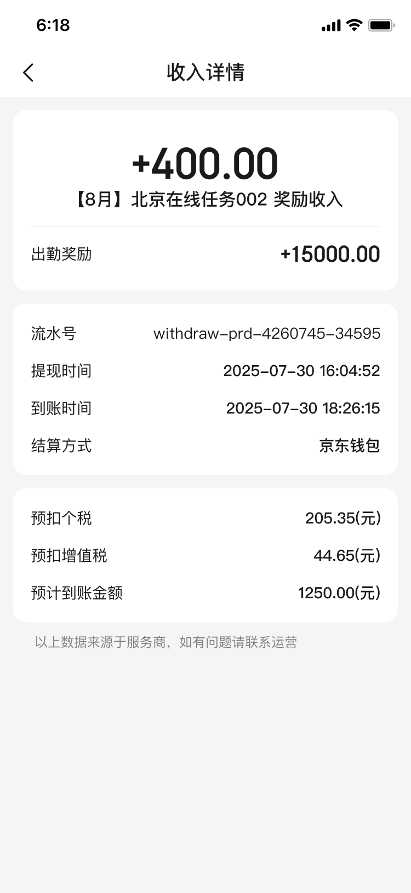 | 收入详情展示费用来源 1. 展示对应奖励类型和金额 2. 展示对应劳动者侧任务名称及阶梯 &nbsp;&nbsp;&nbsp;&nbsp;a. 举例：8月出勤任务阶梯一 &nbsp;&nbsp;&nbsp;&nbsp;b. 不同阶梯不合并发放，都为单独的一笔收入 |   |

## 2.2 **【京家政】**

（UI出来需要过法务）[https://3.cn/11B-6T8oq](https://3.cn/11B-6T8oq) 王子旭邀请你加入【26年👩家政B端设计】Relay文件，快来加入试试吧！

| **序号** | **模块** | **示意图** | **需求详述** | **备注** |
| --- | --- | --- | --- | --- |
| 1 | 子任务状态枚举释义 |   | 劳动者侧的子任务状态流程 1. 派发阶段  &nbsp;&nbsp;&nbsp;&nbsp;a. 大任务进入生效中，系统根据周期生成子任务 ，状态为【进行中】 2. 进行阶段 &nbsp;&nbsp;&nbsp;&nbsp;a. 只要还存在可继续完成的任务，都算做【进行中】 3. 任务到期结束或提前结束 &nbsp;&nbsp;&nbsp;&nbsp;a. 正常结算（周期结束）  满足所有阶梯变为【全部达成】 &nbsp;&nbsp;&nbsp;&nbsp;b. 均未满足变为【未达成】 &nbsp;&nbsp;&nbsp;&nbsp;c. 仅满足部分阶梯变为【部分达成】 4. 异常中断  &nbsp;&nbsp;&nbsp;&nbsp;a. 大任务被人工提前下线 状态变为【已失效】 |   |
| 2 | 工作台 | 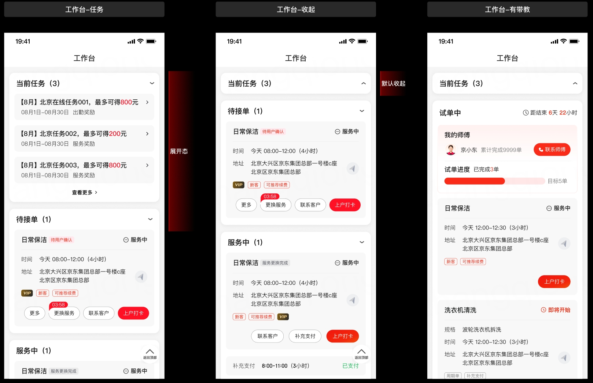 | **【任务模块&卡片】** 1. 模块展示 &nbsp;&nbsp;&nbsp;&nbsp;a. 在工作台首页待接单、服务中模块上方新增“当前任务”模块 &nbsp;&nbsp;&nbsp;&nbsp;b. 任务模块置顶，高于带教 &nbsp;&nbsp;&nbsp;&nbsp;c. 仅当劳动者存在进行中子任务时展示该模块，无进行中任务时不展示 &nbsp;&nbsp;&nbsp;&nbsp;d. 支持手动折叠：向下平铺展示最多3个进行中的任务卡片，超出不展示，通过“查看更多”全部任务列表查看 &nbsp;&nbsp;&nbsp;&nbsp;&nbsp;&nbsp;&nbsp;&nbsp;i. 三个卡片的排序逻辑 &nbsp;&nbsp;&nbsp;&nbsp;&nbsp;&nbsp;&nbsp;&nbsp;&nbsp;&nbsp;&nbsp;&nbsp;1. ~~一个子任务只展示一个任务卡片（一个阶梯），优先展示未完成的最低阶梯（阶梯一）~~ &nbsp;&nbsp;&nbsp;&nbsp;&nbsp;&nbsp;&nbsp;&nbsp;&nbsp;&nbsp;&nbsp;&nbsp;2. ~~如果低阶梯失败就换成下一级进行中的展示~~ &nbsp;&nbsp;&nbsp;&nbsp;&nbsp;&nbsp;&nbsp;&nbsp;&nbsp;&nbsp;&nbsp;&nbsp;3. 优先按照任务截止时间距离短的排序，如果一样的话再按照金额，再一样随机排 &nbsp;&nbsp;&nbsp;&nbsp;e. 当前任务数量：仅统计并展示处于“进行中”状态，且对该劳动者个人而言为现在已经参与的，并且没有完全失败也没有完全完成的任务 &nbsp;&nbsp;&nbsp;&nbsp;f. ~~当天最新失败的任务当日依然展示，次日不展示，即当天失败的任务状态保持进行中状态，次日转为未达成~~ &nbsp;&nbsp;&nbsp;&nbsp;&nbsp;&nbsp;&nbsp;&nbsp;i. ~~自然日~~ 2. 任务卡片 &nbsp;&nbsp;&nbsp;&nbsp;a. 基础信息 &nbsp;&nbsp;&nbsp;&nbsp;&nbsp;&nbsp;&nbsp;&nbsp;i. 标题： &nbsp;&nbsp;&nbsp;&nbsp;&nbsp;&nbsp;&nbsp;&nbsp;&nbsp;&nbsp;&nbsp;&nbsp;1. 若为自然月、自然周任务，需要拼接X月/X月第几周\+任务名称作为该子任务的名字展示 &nbsp;&nbsp;&nbsp;&nbsp;&nbsp;&nbsp;&nbsp;&nbsp;&nbsp;&nbsp;&nbsp;&nbsp;2. 若为指定日期任务，名字展示任务名称 &nbsp;&nbsp;&nbsp;&nbsp;&nbsp;&nbsp;&nbsp;&nbsp;ii. 起止日期 &nbsp;&nbsp;&nbsp;&nbsp;&nbsp;&nbsp;&nbsp;&nbsp;iii. 任务类型 &nbsp;&nbsp;&nbsp;&nbsp;&nbsp;&nbsp;&nbsp;&nbsp;iv. 最高可得金额 &nbsp;&nbsp;&nbsp;&nbsp;&nbsp;&nbsp;&nbsp;&nbsp;&nbsp;&nbsp;&nbsp;&nbsp;1. 阶梯金额总和 &nbsp;&nbsp;&nbsp;&nbsp;&nbsp;&nbsp;&nbsp;&nbsp;v. ~~倒计时：计算当天日期和子任务结束时间的差值~~ &nbsp;&nbsp;&nbsp;&nbsp;&nbsp;&nbsp;&nbsp;&nbsp;&nbsp;&nbsp;&nbsp;&nbsp;&nbsp;&nbsp;&nbsp;&nbsp;1. ~~当因不满足约束条件不能完成时~~ &nbsp;&nbsp;&nbsp;&nbsp;&nbsp;&nbsp;&nbsp;&nbsp;&nbsp;&nbsp;&nbsp;&nbsp;&nbsp;&nbsp;&nbsp;&nbsp;&nbsp;&nbsp;&nbsp;&nbsp;1. ~~该阶梯直接灰态/标红提示（如：“差评\>0，该阶梯已失效”），进度条停止该阶梯的推进~~ &nbsp;&nbsp;&nbsp;&nbsp;&nbsp;&nbsp;&nbsp;&nbsp;&nbsp;&nbsp;&nbsp;&nbsp;&nbsp;&nbsp;&nbsp;&nbsp;&nbsp;&nbsp;&nbsp;&nbsp;2. ~~跨月的截止日期~~  |   |
| 3 | 任务详情 | 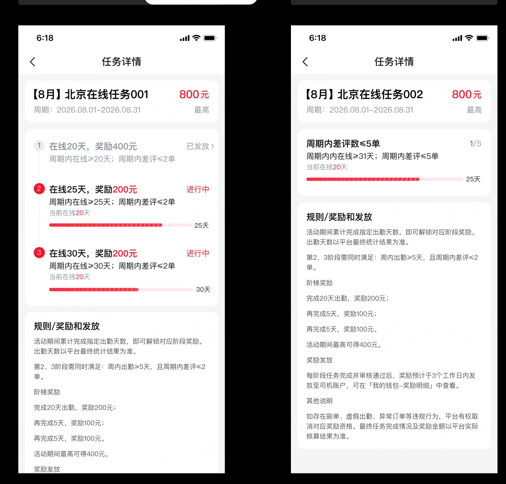 | 任务详情 1. 入口：点击工作台任务卡片或任务列表卡片进入 2. 模块构成： &nbsp;&nbsp;&nbsp;&nbsp;a. 子任务标题：同上任务卡片 &nbsp;&nbsp;&nbsp;&nbsp;&nbsp;&nbsp;&nbsp;&nbsp;i. 标题： &nbsp;&nbsp;&nbsp;&nbsp;&nbsp;&nbsp;&nbsp;&nbsp;&nbsp;&nbsp;&nbsp;&nbsp;1. 若为自然月、自然周任务，需要拼接X月/X月第几周\+任务名称作为该子任务的名字展示 &nbsp;&nbsp;&nbsp;&nbsp;&nbsp;&nbsp;&nbsp;&nbsp;&nbsp;&nbsp;&nbsp;&nbsp;2. 若为指定日期任务，名字展示任务名称 &nbsp;&nbsp;&nbsp;&nbsp;&nbsp;&nbsp;&nbsp;&nbsp;ii. 子任务起止日期 &nbsp;&nbsp;&nbsp;&nbsp;&nbsp;&nbsp;&nbsp;&nbsp;iii. 任务类型 &nbsp;&nbsp;&nbsp;&nbsp;&nbsp;&nbsp;&nbsp;&nbsp;iv. 最高可得金额 &nbsp;&nbsp;&nbsp;&nbsp;&nbsp;&nbsp;&nbsp;&nbsp;&nbsp;&nbsp;&nbsp;&nbsp;1. 阶梯金额总和 &nbsp;&nbsp;&nbsp;&nbsp;b. 动态进度条 &nbsp;&nbsp;&nbsp;&nbsp;&nbsp;&nbsp;&nbsp;&nbsp;i. 进度条计算规则 &nbsp;&nbsp;&nbsp;&nbsp;&nbsp;&nbsp;&nbsp;&nbsp;&nbsp;&nbsp;&nbsp;&nbsp;1. 出勤奖励：根据阶梯设置的主条件数量和当前已达到的比例展示 &nbsp;&nbsp;&nbsp;&nbsp;&nbsp;&nbsp;&nbsp;&nbsp;&nbsp;&nbsp;&nbsp;&nbsp;&nbsp;&nbsp;&nbsp;&nbsp;1. 举例：当前5天/总20天 &nbsp;&nbsp;&nbsp;&nbsp;&nbsp;&nbsp;&nbsp;&nbsp;&nbsp;&nbsp;&nbsp;&nbsp;2. 服务奖励：子任务已经进行的时间/任务全时间 &nbsp;&nbsp;&nbsp;&nbsp;&nbsp;&nbsp;&nbsp;&nbsp;&nbsp;&nbsp;&nbsp;&nbsp;&nbsp;&nbsp;&nbsp;&nbsp;1. 举例：任务已进行5天/整个子任务为30天 &nbsp;&nbsp;&nbsp;&nbsp;&nbsp;&nbsp;&nbsp;&nbsp;ii. ~~阶梯文案~~ &nbsp;&nbsp;&nbsp;&nbsp;&nbsp;&nbsp;&nbsp;&nbsp;&nbsp;&nbsp;&nbsp;&nbsp;1. ~~提示累计可得金额，如：“”再出勤X天，奖励200元”，强化激励感知~~ &nbsp;&nbsp;&nbsp;&nbsp;&nbsp;&nbsp;&nbsp;&nbsp;&nbsp;&nbsp;&nbsp;&nbsp;&nbsp;&nbsp;&nbsp;&nbsp;1. ~~再出勤根据递进阶梯计算差值，服务奖励不需要~~ &nbsp;&nbsp;&nbsp;&nbsp;&nbsp;&nbsp;&nbsp;&nbsp;&nbsp;&nbsp;&nbsp;&nbsp;&nbsp;&nbsp;&nbsp;&nbsp;2. ~~金额：已获得\+当前阶梯可获得总金额~~ &nbsp;&nbsp;&nbsp;&nbsp;&nbsp;&nbsp;&nbsp;&nbsp;&nbsp;&nbsp;&nbsp;&nbsp;&nbsp;&nbsp;&nbsp;&nbsp;3. ~~举例：阶梯1奖励200，阶梯2奖励300，如果现在还在做阶梯1，展示200；如果阶梯1已完成，在做阶梯2，展示500~~ &nbsp;&nbsp;&nbsp;&nbsp;&nbsp;&nbsp;&nbsp;&nbsp;&nbsp;&nbsp;&nbsp;&nbsp;2. ~~根据主条件门槛进行提示~~ &nbsp;&nbsp;&nbsp;&nbsp;&nbsp;&nbsp;&nbsp;&nbsp;&nbsp;&nbsp;&nbsp;&nbsp;&nbsp;&nbsp;&nbsp;&nbsp;1. ~~出勤奖励：提示再出勤N天~~ &nbsp;&nbsp;&nbsp;&nbsp;&nbsp;&nbsp;&nbsp;&nbsp;&nbsp;&nbsp;&nbsp;&nbsp;&nbsp;&nbsp;&nbsp;&nbsp;2. ~~服务奖励：提示保持差评低于X条~~ &nbsp;&nbsp;&nbsp;&nbsp;&nbsp;&nbsp;&nbsp;&nbsp;iii. 进度条从第一阶梯开始展示，第一阶梯达成了再用第二阶梯 &nbsp;&nbsp;&nbsp;&nbsp;&nbsp;&nbsp;&nbsp;&nbsp;iv. ~~最高可得金额：子任务里所有阶梯金额的总和~~ &nbsp;&nbsp;&nbsp;&nbsp;c. 任务规则 &nbsp;&nbsp;&nbsp;&nbsp;&nbsp;&nbsp;&nbsp;&nbsp;i. ~~任务时间：为当前子任务的起止日期~~ &nbsp;&nbsp;&nbsp;&nbsp;&nbsp;&nbsp;&nbsp;&nbsp;ii. ~~适用条线、城市：展示该任务适用的全部条线和城市~~ &nbsp;&nbsp;&nbsp;&nbsp;&nbsp;&nbsp;&nbsp;&nbsp;iii. 达标奖励阶梯 &nbsp;&nbsp;&nbsp;&nbsp;&nbsp;&nbsp;&nbsp;&nbsp;&nbsp;&nbsp;&nbsp;&nbsp;1. 展示各阶梯的奖励金额及达成条件：主条件 \+ 该阶梯独立约束条件 &nbsp;&nbsp;&nbsp;&nbsp;&nbsp;&nbsp;&nbsp;&nbsp;&nbsp;&nbsp;&nbsp;&nbsp;2. 进行中的阶梯打标“进行中” &nbsp;&nbsp;&nbsp;&nbsp;&nbsp;&nbsp;&nbsp;&nbsp;&nbsp;&nbsp;&nbsp;&nbsp;3. 已达成的阶梯打标“已达成” &nbsp;&nbsp;&nbsp;&nbsp;&nbsp;&nbsp;&nbsp;&nbsp;&nbsp;&nbsp;&nbsp;&nbsp;&nbsp;&nbsp;&nbsp;&nbsp;1. 状态后续不会变更，已达成必须所有条件都满足 &nbsp;&nbsp;&nbsp;&nbsp;&nbsp;&nbsp;&nbsp;&nbsp;&nbsp;&nbsp;&nbsp;&nbsp;4. 因主条件或约束条件导致无法达成的阶梯打上“已失败”标识 &nbsp;&nbsp;&nbsp;&nbsp;&nbsp;&nbsp;&nbsp;&nbsp;&nbsp;&nbsp;&nbsp;&nbsp;5. 已发放奖励的阶梯展示“已发放”，点击可跳转收入详情页 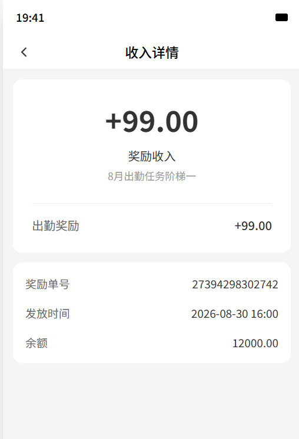 &nbsp;&nbsp;&nbsp;&nbsp;&nbsp;&nbsp;&nbsp;&nbsp;&nbsp;&nbsp;&nbsp;&nbsp;1. 提示累计可得金额，如：“”出勤X天，奖励200元”，强化激励感知 &nbsp;&nbsp;&nbsp;&nbsp;&nbsp;&nbsp;&nbsp;&nbsp;&nbsp;&nbsp;&nbsp;&nbsp;&nbsp;&nbsp;&nbsp;&nbsp;1. 根据配置的阶梯规则，直接展示 &nbsp;&nbsp;&nbsp;&nbsp;&nbsp;&nbsp;&nbsp;&nbsp;&nbsp;&nbsp;&nbsp;&nbsp;2. 服务奖励展示当前差评数/阶梯差评数，如1/5 &nbsp;&nbsp;&nbsp;&nbsp;&nbsp;&nbsp;&nbsp;&nbsp;&nbsp;&nbsp;&nbsp;&nbsp;3. 展示当前在线天数 &nbsp;&nbsp;&nbsp;&nbsp;a. 奖励发放文案展示 &nbsp;&nbsp;&nbsp;&nbsp;&nbsp;&nbsp;&nbsp;&nbsp;i. 任务详情文案： 1.时长奖励 标题：奖励条件与发放规则 固定文案内容：活动周期内累计可接单达到指定天数，即可结算对应阶段奖励，可接单天数以平台最终统计结果为准 条件取值：可接单xx天，奖励xx元；可接单xx天，奖励xx元 奖励发放：每阶段任务完成并审核通过后，奖励预计于3个工作日内发放，可在【我的收入-收入明细】中查看。 其他说明：如存在违规行为，平台有权取消对应奖励发放，最终任务完成情况及奖励金额以平台实际核算为准。 &nbsp;&nbsp;&nbsp;&nbsp;&nbsp;&nbsp;&nbsp;&nbsp;ii. 服务奖励 标题：奖励条件与发放规则 固定文案内容：活动周期内累计可接单达到指定天数且差评数量小于底线要求，即可结算对应阶段奖励，具体达成以平台最终统计结果为准 条件取值：差评<=多少条，且可接单天数达xx天，奖励xx元；差评<=多少条，且可接单天数达xx天，奖励xx元 奖励发放：每阶段任务完成并审核通过后，奖励预计于3个工作日内发放，可在【我的收入-收入明细】中查看。 其他说明：如存在违规行为，平台有权取消对应奖励发放，最终任务完成情况及奖励金额以平台实际核算为准。 |   |
| 4 | 任务中心 | 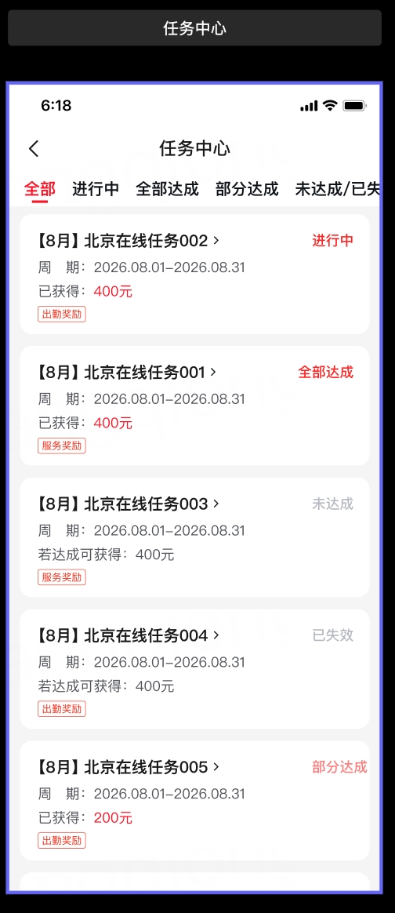 | 任务中心 1. 入口 &nbsp;&nbsp;&nbsp;&nbsp;a. 固定入口：我的-任务中心 &nbsp;&nbsp;&nbsp;&nbsp;b. 点击任务卡片-全部任务进入 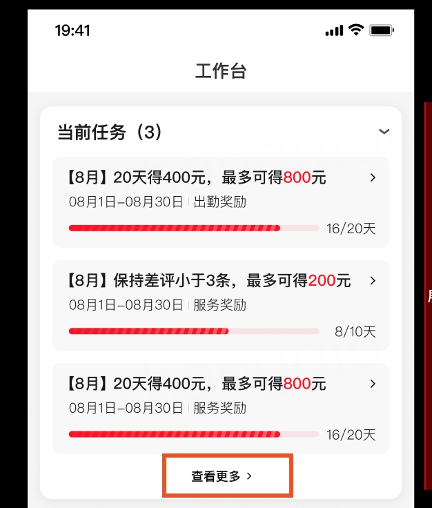 1. 展示规则 &nbsp;&nbsp;&nbsp;&nbsp;a. 按子任务创建时间倒序平铺展示该劳动者历史接收到及当前正在进行的所有子任务 &nbsp;&nbsp;&nbsp;&nbsp;b. 加分页 &nbsp;&nbsp;&nbsp;&nbsp;c. 区分不同奖励类型的任务 注：一个阿姨一个月有2-5个子任务，暂定保留近六个月的数据 1. 展示信息：奖励类型、任务名称、状态、金额、周期 &nbsp;&nbsp;&nbsp;&nbsp;a. 金额：为所有阶梯金额的总和 2. 状态标签 &nbsp;&nbsp;&nbsp;&nbsp;a. 支持根据状态tab筛选 &nbsp;&nbsp;&nbsp;&nbsp;b. 进行中（中间态）：任务处于生效中，且仍有可冲刺的阶梯目标 &nbsp;&nbsp;&nbsp;&nbsp;c. 全部达成（终态）：任务周期结束或进行中，但所有的奖励阶梯均已满足条件 &nbsp;&nbsp;&nbsp;&nbsp;d. 部分达成（终态）：任务已结束，只满足了部分阶梯的要求（例如达成了一阶，但二阶未达成） &nbsp;&nbsp;&nbsp;&nbsp;e. 未达成/已失效（终态）： &nbsp;&nbsp;&nbsp;&nbsp;&nbsp;&nbsp;&nbsp;&nbsp;i. 未达成： &nbsp;&nbsp;&nbsp;&nbsp;&nbsp;&nbsp;&nbsp;&nbsp;&nbsp;&nbsp;&nbsp;&nbsp;1. 任务已结束且未满足任何一条阶梯条件 &nbsp;&nbsp;&nbsp;&nbsp;&nbsp;&nbsp;&nbsp;&nbsp;&nbsp;&nbsp;&nbsp;&nbsp;2. 任务进行中但差评数量已经不符合配置的条件，彻底无法达成 &nbsp;&nbsp;&nbsp;&nbsp;&nbsp;&nbsp;&nbsp;&nbsp;ii. 已失效： &nbsp;&nbsp;&nbsp;&nbsp;&nbsp;&nbsp;&nbsp;&nbsp;&nbsp;&nbsp;&nbsp;&nbsp;1. ~~任务结束或~~任务被运营手动下线中止 &nbsp;&nbsp;&nbsp;&nbsp;&nbsp;&nbsp;&nbsp;&nbsp;&nbsp;&nbsp;&nbsp;&nbsp;2. 阿姨中途下线或者换城 &nbsp;&nbsp;&nbsp;&nbsp;f. 已获得：按照出计费来判断 &nbsp;&nbsp;&nbsp;&nbsp;g. 若达成可获得：活动没有到终态之前都是若完成可获得 |   |
| 5 | 我的 |  | 收入详情展示费用来源 1. 展示对应奖励类型和金额 2. 展示对应劳动者侧任务名称及阶梯 &nbsp;&nbsp;&nbsp;&nbsp;a. 举例：8月出勤任务阶梯一 &nbsp;&nbsp;&nbsp;&nbsp;b. 不同阶梯不合并发放，都为单独的一笔收入 信息展示待确定 1. 从任务列表进入和从【我的收入】收入明细中进入均需展示 |   |
| 6 | 预计收入 |  | 1. 已经确认发放的奖励要展示在预计收入里 &nbsp;&nbsp;&nbsp;&nbsp;a. 入账了之后，等待结算的时候就展示明细 |   |
| 7 | 任务中心入口 |  | 1. 【我的工具】增加任务中心入口 |   |

# **三、附件**

[📄 【BRD】劳动者任务系统](https://joyspace.jd.com/pages/ICBuBiVlCg4UNuIDGvW9)

# **四、资损场景**

[📄 劳动者任务系统 · 资损场景梳理](https://joyspace.jd.com/pages/ha7gUoRQsreWANZG4wtc)

## 评论 (8)

- **张振鑫** · 2026-08-10T06:19:08.000Z · 锚定：「服务条线为日保时：服务条线为家电时：服务条线为全部时：」
  这个是已有的审批流么？ 还是要新建一套
  - **张琼(Joann)** · 2026-08-10T07:42:55.000Z · 锚定：「服务条线为日保时：服务条线为家电时：服务条线为全部时：」
    不是已有的，任务整个模块都是新的
- **张振鑫** · 2026-08-10T12:35:44.000Z · 锚定：「若不开启，则只在开始日期的当月/周生成子任务」
  循环不开启的时候，
   生成的开始时间 是当天 ， 还是 周/月的起始日呢？
- **薛一冰** · 2026-09-02T03:19:21.000Z · 锚定：「按钮需增加权限配置」
  下载按钮是在每条任务的操作列么？
  - **张琼(Joann)** · 2026-09-02T03:40:18.000Z
    嗯嗯是的，这个下载是子任务的信息，上面的导出是整个列表的主任务信息
  - **薛一冰** · 2026-09-02T03:41:34.000Z
    所有状态的任务都有这个按钮么？
- **薛一冰** · 2026-09-02T10:33:25.000Z · 锚定：「状态标签」
  不同状态任务的金额文案展示情况是否如下？
  * 进行中：若达成可获得xx元
  * 全部达成：已获得xx元
  * 部分达成：已获得xx元
  * 未达成/已失效：若达成可获得xx元
- **薛一冰** · 2026-09-02T10:34:11.000Z · 锚定：「进行中（中间态）：任务处于生效中，且仍有可冲刺的阶梯目标」
  仅包括进行中，且未达成任一阶梯的任务？

## 资源映射（原始链接 → 本地路径）

| 类型 | 原始链接 | 本地路径 |
|---|---|---|
| 图片 | https://apijoyspace.jd.com/v1/files/bCYZDiitFLV7F6SX2eaw/link | 【PRD】劳动者任务系统_images/image001_bCYZDiitFLV7F6SX2eaw.png |
| 图片 | https://apijoyspace.jd.com/v1/files/ZlJ1PIfA6sCek0Mi2qyX/link | 【PRD】劳动者任务系统_images/image002_ZlJ1PIfA6sCek0Mi2qyX.png |
| 图片 | https://apijoyspace.jd.com/v1/files/zn2MxiyLiUndHFrKEWPI/link | 【PRD】劳动者任务系统_images/image003_zn2MxiyLiUndHFrKEWPI.png |
| 图片 | https://apijoyspace.jd.com/v1/files/4f0kg1XFGMFmhMXFNijR/link | 【PRD】劳动者任务系统_images/image004_4f0kg1XFGMFmhMXFNijR.png |
| 图片 | https://apijoyspace.jd.com/v1/files/BfB1Zr5pH9fjpHApjJhj/link | 【PRD】劳动者任务系统_images/image005_BfB1Zr5pH9fjpHApjJhj.png |
| 图片 | https://apijoyspace.jd.com/v1/files/TaaVvRqjaZilithIMtkh/link | 【PRD】劳动者任务系统_images/image006_TaaVvRqjaZilithIMtkh.png |
| 图片 | https://apijoyspace.jd.com/v1/files/lzL5cfNAksB0aEDitdNm/link | 【PRD】劳动者任务系统_images/image007_lzL5cfNAksB0aEDitdNm.png |
| 图片 | https://apijoyspace.jd.com/v1/files/nzFPk7cjOOJot5BFxYTO/link | 【PRD】劳动者任务系统_images/image008_nzFPk7cjOOJot5BFxYTO.png |
| 图片 | https://apijoyspace.jd.com/v1/files/IAH9mKkshvQ5fziijHew/link | 【PRD】劳动者任务系统_images/image009_IAH9mKkshvQ5fziijHew.png |
| 图片 | https://apijoyspace.jd.com/v1/files/5VouaDDoH9C9NkdPxjeY/link | 【PRD】劳动者任务系统_images/image010_5VouaDDoH9C9NkdPxjeY.png |
| 图片 | https://apijoyspace.jd.com/v1/files/1zf12sjxCQs9ezHsK5nJ/link | 【PRD】劳动者任务系统_images/image011_1zf12sjxCQs9ezHsK5nJ.png |
| 图片 | https://apijoyspace.jd.com/v1/files/HXa6UddT1lZ5ii1jrtyY/link | 【PRD】劳动者任务系统_images/image012_HXa6UddT1lZ5ii1jrtyY.png |
| 图片 | https://apijoyspace.jd.com/v1/files/J1rmBOaKGqOz0XYHGrfl/link | 【PRD】劳动者任务系统_images/image013_J1rmBOaKGqOz0XYHGrfl.png |
| 图片 | https://apijoyspace.jd.com/v1/files/hIcKdwtfRxDFIhnq0ff3/link | 【PRD】劳动者任务系统_images/image014_hIcKdwtfRxDFIhnq0ff3.png |
| 图片 | https://apijoyspace.jd.com/v1/files/Kksdz188JkJPTjr2rpx5/link | 【PRD】劳动者任务系统_images/image015_Kksdz188JkJPTjr2rpx5.png |
| 图片 | https://apijoyspace.jd.com/v1/files/dIRAIwcB240iYclQ1cv5/link | 【PRD】劳动者任务系统_images/image016_dIRAIwcB240iYclQ1cv5.png |
| 图片 | https://apijoyspace.jd.com/v1/files/6rIwl6X5i2EOtIeXNVD0/link | 【PRD】劳动者任务系统_images/image017_6rIwl6X5i2EOtIeXNVD0.png |
| 图片 | https://apijoyspace.jd.com/v1/files/IF1aAsrbthMWSy0D8FiR/link | 【PRD】劳动者任务系统_images/image018_IF1aAsrbthMWSy0D8FiR.png |
| 图片 | https://apijoyspace.jd.com/v1/files/H329IVkpfUvFDG3BXLJK/link | 【PRD】劳动者任务系统_images/image019_H329IVkpfUvFDG3BXLJK.png |
| 图片 | https://apijoyspace.jd.com/v1/files/Uwna0ARYoxPxwz3HpEFV/link | 【PRD】劳动者任务系统_images/image020_Uwna0ARYoxPxwz3HpEFV.png |
| 图片 | https://apijoyspace.jd.com/v1/files/4vwu5TgH1j2gJ7trYBLv/link | 【PRD】劳动者任务系统_images/image021_4vwu5TgH1j2gJ7trYBLv.png |
| 附件 | https://apijoyspace.jd.com/v1/files/3WGbFaLb9W56Gy7UaqEE/link | 【PRD】劳动者任务系统_attachments/家电服务类型.xlsx |
