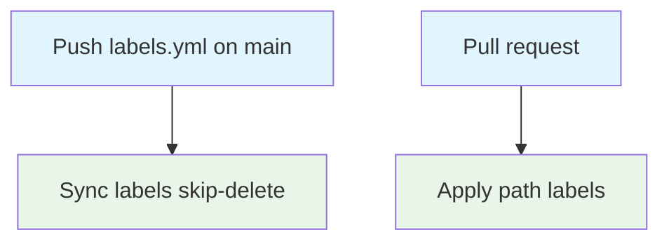

## Workflow overview

**Purpose**: Keep repository labels defined in `.github/labels.yml`, and apply path labels to pull requests from `.github/labeler.yml`.
**Trigger**: Push to `main` of the label catalog or this workflow; pull request `opened`, `synchronize`, `reopened`.
**Target**: GitHub issues and pull requests in this repository.

## Execution flow

## Jobs and dependencies

| Job         | Purpose                                                                       | When                | Runner        |
| ----------- | ----------------------------------------------------------------------------- | ------------------- | ------------- |
| sync-labels | Create or update labels from `.github/labels.yml`; do not delete extra labels | `push` only         | ubuntu-latest |
| label-pr    | Match changed files to labels; `sync-labels: true` on the PR                  | `pull_request` only | ubuntu-latest |

## Requirements

| ID      | Requirement                                              | Priority | Acceptance                                                |
| ------- | -------------------------------------------------------- | -------- | --------------------------------------------------------- |
| REQ-001 | Catalog is the source for label name, color, description | High     | Push to `main` updates GitHub labels                      |
| REQ-002 | Do not delete labels missing from the catalog            | High     | `skip-delete: true`                                       |
| REQ-003 | Path labels follow `.github/labeler.yml`                 | High     | PR files under `src/` get `frontend`, and so on           |
| REQ-004 | CI paths include composite actions                       | Medium   | Changes under `.github/actions/**` get `ci`               |
| REQ-005 | Documentation paths include `spec/`                      | Medium   | Changes under `spec/**` get `documentation`               |
| REQ-006 | Permissions are least privilege                          | High     | `contents: read`; `issues: write`; `pull-requests: write` |

## Execution constraints

- Timeout: 5 min per job.
- Concurrency: one group per PR number or ref; cancel in-progress.
- Token: default `GITHUB_TOKEN`.

## Error handling

| Error                | Response                 | Recovery                     |
| -------------------- | ------------------------ | ---------------------------- |
| Labeler mapping miss | PR may lack a path label | Extend `.github/labeler.yml` |
| Fork PR token limits | Label step may no-op     | Maintainer applies labels    |

## Related

- Implementation: `.github/workflows/labeler.yml`, `.github/labels.yml`, `.github/labeler.yml`
