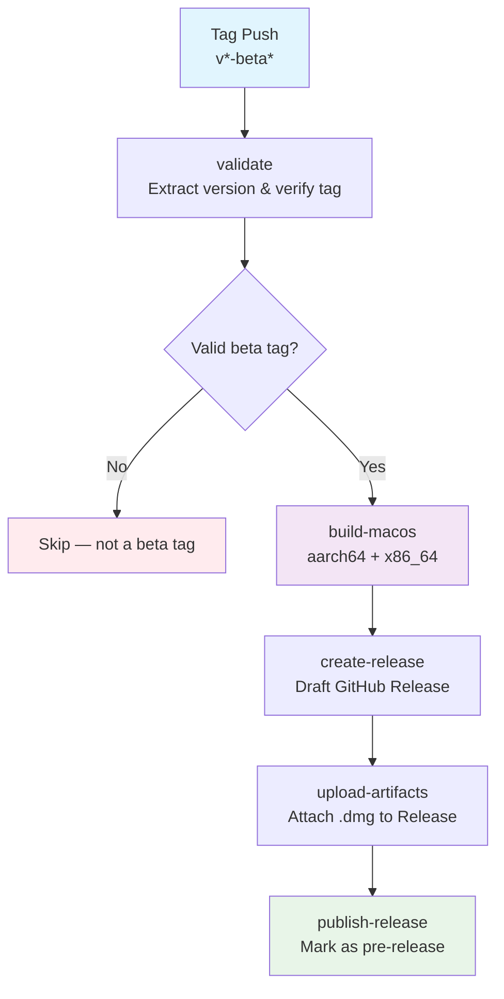

## Workflow Overview

**Purpose**: 识别 `beta` git tag 推送，构建 Tauri v2 macOS 安装包（.dmg + .app），创建 GitHub Release（pre-release），上传安装包供下载。
**Trigger Events**: `push.tags` 匹配 `v*-beta*` 模式（如 `v0.1.0-beta.1`）
**Target Environments**: macOS (Apple Silicon arm64 + Intel x64)

## Execution Flow Diagram



## Jobs & Dependencies

| Job Name | Purpose | Dependencies | Execution Context |
|----------|---------|--------------|-------------------|
| validate | 提取版本号、验证 beta tag 格式 | — | ubuntu-latest |
| build-macos | 构建 Tauri macOS 安装包 (arm64 + x64) | validate | macos-latest (matrix) |
| create-release | 创建 GitHub Release (draft) | build-macos | ubuntu-latest |
| publish-release | 上传产物、标记为 pre-release 并发布 | create-release | ubuntu-latest |

## Requirements Matrix

### Functional Requirements

| ID | Requirement | Priority | Acceptance Criteria |
|----|-------------|----------|-------------------|
| REQ-001 | 识别 `v*-beta*` tag 触发构建 | High | 只有匹配 `v*-beta*` 的 tag push 触发 workflow |
| REQ-002 | 构建 macOS arm64 (Apple Silicon) .dmg | High | 产出 `Poria-{version}-aarch64.dmg` 可安装 |
| REQ-003 | 构建 macOS x64 (Intel) .dmg | High | 产出 `Poria-{version}-x64.dmg` 可安装 |
| REQ-004 | 从 git tag 提取版本号 | High | `v0.1.0-beta.1` → version=`0.1.0-beta.1` |
| REQ-005 | 同步版本号到 tauri.conf.json 和 Cargo.toml | High | 构建产物的版本号与 tag 一致 |
| REQ-006 | 创建 GitHub Release (pre-release) | High | Release 标题含版本号，标记为 pre-release |
| REQ-007 | 上传 .dmg 文件到 Release | High | Release 页面可直接下载 .dmg |
| REQ-008 | Release body 包含变更摘要 | Medium | 自动生成 changelog 或从 tag annotation 提取 |
| REQ-009 | 产物命名规范 | Medium | `Poria-{version}-{arch}.dmg` 格式 |
| REQ-010 | 构建前端 + Rust 后端 | High | `pnpm install` → `cargo tauri build` 成功 |

### Security Requirements

| ID | Requirement | Implementation Constraint |
|----|-------------|---------------------------|
| SEC-001 | 不泄露签名证书 | macOS 签名凭据仅通过 GitHub Secrets 注入 |
| SEC-002 | 最小权限原则 | `permissions: contents: write` 仅在 release 相关 job |
| SEC-003 | 固定 action 版本 | 所有 `uses:` 引用固定 commit SHA 或精确版本 |
| SEC-004 | 不在日志中暴露密钥 | 所有 secret 使用 `${{ secrets.* }}`，不 echo |

### Performance Requirements

| ID | Metric | Target | Measurement Method |
|----|--------|--------|-------------------|
| PERF-001 | 总构建时间 | < 30 min (含两个 arch) | GitHub Actions 运行时间 |
| PERF-002 | 产物大小 | < 100 MB per .dmg | Release 产物文件大小 |
| PERF-003 | Rust 编译缓存命中 | > 50% 缓存命中 | `actions/cache` hit rate |

## Input/Output Contracts

### Inputs

```yaml
# Trigger
trigger: push.tags
tag_pattern: "v*-beta*"   # e.g. v0.1.0-beta.1, v0.2.0-beta.3

# Repository Structure
frontend_dir: apps/desktop/
tauri_dir: apps/desktop/src-tauri/
```

### Outputs

```yaml
# Job Outputs
validate.version: string         # Extracted version, e.g. "0.1.0-beta.1"
validate.tag: string             # Full tag, e.g. "v0.1.0-beta.1"

# Build Artifacts
build-macos.dmg: file            # Poria-{version}-{arch}.dmg
build-macos.updater: file        # latest.json (optional, for auto-updater)

# Release
release.url: string              # GitHub Release URL
release.upload_url: string       # Upload URL for assets
```

### Secrets & Variables

| Type | Name | Purpose | Scope |
|------|------|---------|-------|
| Secret | APPLE_CERTIFICATE | macOS 代码签名证书 (base64) | Repository |
| Secret | APPLE_CERTIFICATE_PASSWORD | 证书密码 | Repository |
| Secret | APPLE_ID | Apple 开发者账号 (公证用) | Repository |
| Secret | APPLE_PASSWORD | App-specific password (公证用) | Repository |
| Secret | APPLE_TEAM_ID | Apple 开发者团队 ID | Repository |
| Variable | TAURI_SIGNING_PRIVATE_KEY | Tauri updater 签名私钥 (可选, P2) | Repository |

> **MVP 注意**: 如果尚未配置 Apple 签名证书，workflow 应支持跳过签名（仅生成未签名 .dmg），通过环境变量 `SKIP_SIGNING=true` 控制。

## Execution Constraints

### Runtime Constraints

- **Timeout**: validate 5min, build-macos 25min per arch, release jobs 10min
- **Concurrency**: `group: release-${{ github.ref }}`, cancel-in-progress: true
- **Resource Limits**: macOS runner 标准资源 (3 vCPU, 14 GB RAM)

### Environmental Constraints

- **Runner Requirements**: `macos-latest` (macOS 14+, Xcode CLT), `ubuntu-latest`
- **Node.js**: v24.20.0 (与开发环境一致)
- **pnpm**: 11.23.0 (与 packageManager 一致)
- **Rust**: stable (latest)
- **Network Access**: crates.io, npmjs.com, GitHub API
- **Permissions**: `contents: write` (创建 release + 上传 assets)

### Build Matrix

| Target | Runner | Rust Target | Tauri Flag |
|--------|--------|-------------|------------|
| macOS arm64 | macos-latest | aarch64-apple-darwin | --target aarch64-apple-darwin |
| macOS x64 | macos-latest | x86_64-apple-darwin | --target x86_64-apple-darwin |

## Error Handling Strategy

| Error Type | Response | Recovery Action |
|------------|----------|-----------------|
| Tag 格式不匹配 | Skip workflow | 无需操作，非 beta tag 不触发 |
| pnpm install 失败 | Fail job | 检查 lockfile 一致性 |
| Rust 编译失败 | Fail job | 检查 Cargo.lock 和依赖兼容性 |
| Tauri build 失败 | Fail job | 检查 tauri.conf.json 和前端构建 |
| 签名失败 | Warn + 跳过签名 | 如果 SKIP_SIGNING 未设置则 fail |
| Release 创建失败 | Fail job | 检查 GitHub token 权限 |
| 产物上传失败 | Retry 3x | GitHub API 瞬时故障重试 |
| 产物命名冲突 | 覆盖已有同名 asset | 由 `gh release upload --clobber` 处理 |

## Quality Gates

### Gate Definitions

| Gate | Criteria | Bypass Conditions |
|------|----------|-------------------|
| Tag 格式校验 | 匹配 `v[0-9]+.[0-9]+.[0-9]+-beta.[0-9]+` | 不可绕过 |
| 前端 typecheck | `pnpm typecheck` 通过 | 不可绕过 |
| Rust check | `cargo check` 通过 | 不可绕过 |
| 产物存在性 | .dmg 文件生成且 > 1MB | 不可绕过 |
| 签名验证 | `codesign --verify` 通过 | SKIP_SIGNING=true 时跳过 |

## Monitoring & Observability

### Key Metrics

- **Success Rate**: > 95% 构建成功率
- **Execution Time**: < 30 min 端到端
- **Artifact Size**: 跟踪 .dmg 大小变化趋势

### Alerting

| Condition | Severity | Notification Target |
|-----------|----------|-------------------|
| 构建失败 | High | GitHub commit status + email |
| 构建超时 (>30min) | Medium | GitHub Actions 自动取消 |
| 产物异常 (<1MB) | High | Fail job |

## Integration Points

### External Systems

| System | Integration Type | Data Exchange | SLA Requirements |
|--------|------------------|---------------|------------------|
| GitHub Releases | API (gh CLI) | .dmg 上传 + release 元数据 | 99.9% 可用性 (GitHub SLA) |
| crates.io | 依赖下载 | Rust crate 拉取 | 构建时可用 |
| npmjs.com | 依赖下载 | npm 包拉取 | 构建时可用 |
| Apple Notarization (P2) | API | 公证请求 + 状态轮询 | 公证可能需 5-15min |

### Dependent Workflows

| Workflow | Relationship | Trigger Mechanism |
|----------|--------------|-------------------|
| CI (未来) | 前置 | beta tag 前应确保 CI 通过 |
| Release (未来) | 后续 | 正式 release 复用构建逻辑，去掉 beta 标记 |

## Edge Cases & Exceptions

### Scenario Matrix

| Scenario | Expected Behavior | Validation Method |
|----------|-------------------|-------------------|
| 同版本重复 tag push | 覆盖已有 Release assets | `gh release upload --clobber` |
| 非 beta tag (如 `v1.0.0`) | 不触发此 workflow | tag filter 排除 |
| beta tag 格式异常 (如 `v1.0-beta`) | validate job 失败，不继续 | 正则校验 |
| macOS runner 无 Xcode | 安装 Xcode CLT | runner 预装 |
| Apple 证书未配置 | 如果 SKIP_SIGNING=true 跳过签名，否则 fail | 环境变量检查 |
| pnpm-lock.yaml 不一致 | 构建失败 | `pnpm install --frozen-lockfile` |
| Cargo.lock 缺失 | 自动生成 | `cargo generate-lockfile` |
| 跨架构编译 (x64 on arm64 runner) | 通过 Rust target + Xcode universal | 矩阵构建 |

## Validation Criteria

### Workflow Validation

- **VLD-001**: 只有 `v*-beta*` 格式的 tag push 触发 workflow
- **VLD-002**: 提取的版本号格式正确（`X.Y.Z-beta.N`）
- **VLD-003**: 每个架构产出恰好一个 .dmg 文件
- **VLD-004**: GitHub Release 标记为 pre-release
- **VLD-005**: Release assets 可通过 URL 直接下载
- **VLD-006**: 产物命名遵循 `Poria-{version}-{arch}.dmg` 规范

### Performance Benchmarks

- **PERF-001**: 首次构建 < 30 min（含 Rust 编译）
- **PERF-002**: 缓存命中时构建 < 15 min
- **PERF-003**: 产物上传 < 2 min

## Implementation Notes

### 版本号同步策略

从 git tag 提取版本号后，需同步到：
1. `apps/desktop/src-tauri/tauri.conf.json` → `version` 字段
2. `apps/desktop/src-tauri/Cargo.toml` → `package.version` 字段
3. `apps/desktop/package.json` → `version` 字段

Tauri v2 的 `cargo tauri build` 从 `tauri.conf.json` 读取版本号生成安装包文件名。

### Tauri Build 产物路径

```
apps/desktop/src-tauri/target/{target}/release/bundle/
├── dmg/
│   └── Poria_{version}_{arch}.dmg
└── macos/
    └── Poria.app
```

`{arch}` 映射：
- `aarch64-apple-darwin` → `aarch64`
- `x86_64-apple-darwin` → `x64`

### Rust 编译缓存

使用 `actions/cache` 缓存 `~/.cargo/registry` + `apps/desktop/src-tauri/target/`，key 基于 `Cargo.lock` hash。

### 安装包重命名

Tauri 默认产物名为 `Poria_{version}_{arch}.dmg`，需重命名为 `Poria-{version}-{arch}.dmg`（连字符分隔）以符合 REQ-009。

## Change Management

### Update Process

1. **Specification Update**: 修改本文档
2. **Review & Approval**: PR review
3. **Implementation**: 更新 `.github/workflows/pre-publish.yml`
4. **Testing**: 创建测试 beta tag 验证
5. **Deployment**: 合并到 main

### Version History

| Version | Date | Changes | Author |
|---------|------|---------|--------|
| 1.0 | 2026-09-16 | Initial specification | heyongqi10 + Claude |

## Related Specifications

- `apps/desktop/src-tauri/tauri.conf.json` — Tauri 构建配置
- `apps/desktop/src-tauri/Cargo.toml` — Rust 依赖和包元数据
- OpenMausBot `.github/workflows/release.yml` — 参考实现
