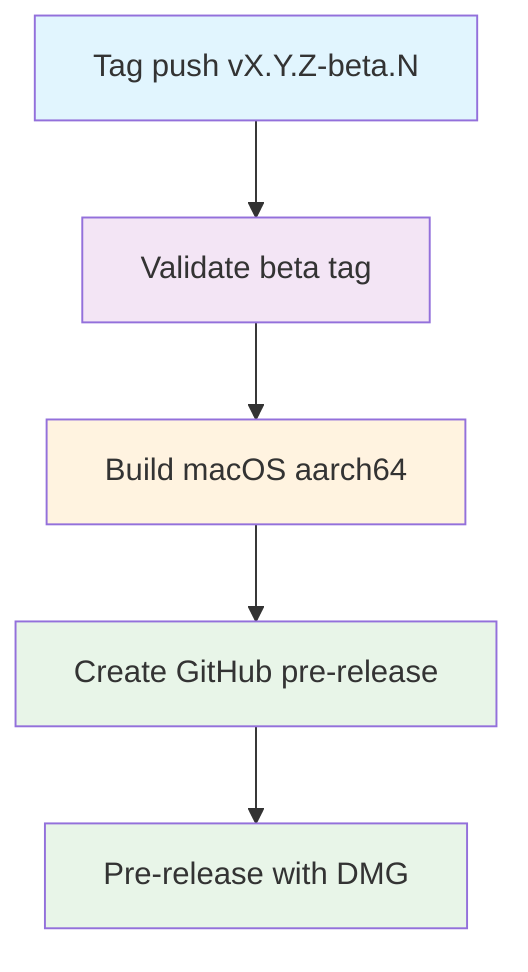

## Workflow overview

**Purpose**: On a beta tag, build one Apple Silicon macOS DMG and publish it as a GitHub **pre-release**.
**Trigger**: Push of a tag matching `v*-beta*`.
**Target**: macOS `aarch64-apple-darwin` distribution only.

Sibling: [Publish (Stable)](./spec-process-cicd-publish.md). Stable tags must not enter this path.

## Execution flow

## Jobs and dependencies

| Job            | Purpose                                               | Depends on            | Runner                              |
| -------------- | ----------------------------------------------------- | --------------------- | ----------------------------------- |
| validate       | Accept only `vX.Y.Z-beta.N`; emit `tag` and `version` | none                  | ubuntu-latest                       |
| build-macos    | Typecheck, bundle, sign or ad-hoc, package DMG        | validate              | macos-latest, matrix arch `aarch64` |
| create-release | Pre-release with DMG, SHA-256, install notes          | validate, build-macos | ubuntu-latest                       |

## Requirements

| ID      | Requirement                                  | Priority | Acceptance                                                                |
| ------- | -------------------------------------------- | -------- | ------------------------------------------------------------------------- |
| REQ-001 | Tag is `vX.Y.Z-beta.N`                       | High     | Reject other `v*-beta*` shapes                                            |
| REQ-002 | One Apple Silicon DMG                        | High     | Asset `Poria-{VERSION}-aarch64.dmg`                                       |
| REQ-003 | Do not build Intel                           | High     | Matrix has no `x86_64-apple-darwin`                                       |
| REQ-004 | Sync tag version into bundle metadata        | High     | `tauri.conf.json`, `src-tauri/Cargo.toml`, `package.json` equal `VERSION` |
| REQ-005 | GitHub pre-release                           | High     | Release marked prerelease; not latest                                     |
| REQ-006 | Frontend typecheck before bundle             | Medium   | Typecheck job step passes                                                 |
| REQ-007 | Missing Apple certificate still yields a DMG | High     | Ad-hoc sign; notes mention `xattr -cr`                                    |
| REQ-008 | DMG larger than 1 MB                         | High     | Smaller file fails the build                                              |
| REQ-009 | SHA-256 in notes                             | Medium   | Checksums listed                                                          |

### Security

| ID      | Constraint                                                                           |
| ------- | ------------------------------------------------------------------------------------ |
| SEC-001 | Apple certificate, notarization identity, and Tauri updater key are optional secrets |
| SEC-002 | `contents: write` only; do not echo secrets                                          |
| SEC-003 | Artifacts are installers, not source trees or credential files                       |

### Performance

| ID       | Metric           | Target |
| -------- | ---------------- | ------ |
| PERF-001 | Validate timeout | 5 min  |
| PERF-002 | Build timeout    | 30 min |
| PERF-003 | Release timeout  | 10 min |

## Input and output

**Inputs**

- Trigger glob: `v*-beta*`
- Pins: Node `24.20.0`, pnpm `11.23.0` (workflow `env`)
- Derived: `TAG` from the git ref; `VERSION` is `TAG` without leading `v`

**Outputs**

- Job: `version`, `tag`
- Artifact (7-day retention, then release asset): `Poria-{VERSION}-aarch64.dmg`
- GitHub pre-release title `Poria Desktop {VERSION} (Beta)`

**Secrets** (all optional except the default `github.token` for `gh release create`)

| Name                                    | Purpose                                   |
| --------------------------------------- | ----------------------------------------- |
| APPLE_CERTIFICATE                       | Base64 p12 for Developer ID               |
| APPLE_CERTIFICATE_PASSWORD              | P12 passphrase                            |
| APPLE_ID, APPLE_PASSWORD, APPLE_TEAM_ID | Notarization, passed into the bundle step |
| TAURI_SIGNING_PRIVATE_KEY               | Tauri updater signing                     |

## Execution constraints

- Concurrency: one run per tag ref; cancel in-progress retries of the same tag.
- Matrix `fail-fast: false` (single arch today; keep this if more arches return).
- Shared toolchain: [Setup macOS Tauri](./spec-process-cicd-setup-macos-tauri.md) with `save-cache: false`.
- Cargo cache restore may come from [Warm Rust cache](./spec-process-cicd-warm-rust-cache.md); a cold cache must still succeed.
- Workflow file on the **tagged commit** is what runs. Editing YAML on `main` does not change an old tag.

## Error handling

| Error                                      | Response                   | Recovery                            |
| ------------------------------------------ | -------------------------- | ----------------------------------- |
| Invalid beta tag                           | Fail validate              | Push a tag matching `vX.Y.Z-beta.N` |
| Typecheck or compile failure               | Fail build                 | Fix on a new commit and new tag     |
| Empty Apple certificate                    | Ad-hoc sign, still publish | Configure secrets later             |
| Notarization rejected when identity is set | Fail build                 | Inspect Apple log                   |
| DMG missing or &lt; 1 MB                   | Fail build                 | Inspect bundle directory            |
| `gh release create` on an existing tag     | Fail release               | Operator deletes or uses a new tag  |

## Quality gates

| Gate                                                                  | Bypass       |
| --------------------------------------------------------------------- | ------------ |
| Tag regex `^[0-9]+\.[0-9]+\.[0-9]+-beta\.[0-9]+$` after stripping `v` | None         |
| Frontend typecheck                                                    | None         |
| Tauri bundle for `aarch64-apple-darwin`                               | None         |
| Apple identity                                                        | Skip; ad-hoc |
| DMG &gt; 1 MB                                                         | None         |
| Release is prerelease                                                 | None         |

## Edge cases

| Scenario                          | Expected behavior                             |
| --------------------------------- | --------------------------------------------- |
| `v1.2.3` (stable)                 | This workflow does not start                  |
| `v1.2.3-beta` (no `.N`)           | Validate fails                                |
| Tag not on `main`                 | Builds the tagged commit anyway               |
| Re-run after a successful release | May fail if the GitHub release already exists |

## Related

- Implementation: `.github/workflows/pre-publish.yml`
- [Publish (Stable)](./spec-process-cicd-publish.md)
- [Warm Rust cache](./spec-process-cicd-warm-rust-cache.md)
- [Setup macOS Tauri](./spec-process-cicd-setup-macos-tauri.md)
