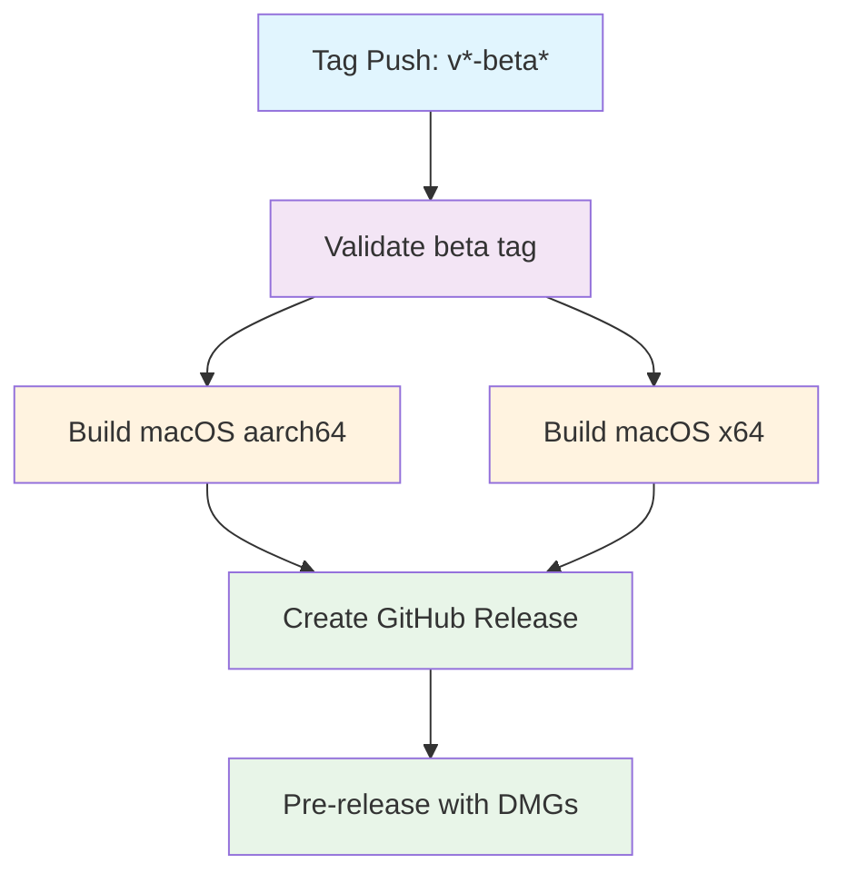

## Workflow Overview

**Purpose**: Build macOS Tauri desktop app for both ARM64 and x64, then publish as a GitHub pre-release on beta tags.
**Trigger Events**: Push of tags matching `v*-beta*`
**Target Environments**: macOS (aarch64 + x86_64)

## Execution Flow Diagram



## Jobs & Dependencies

| Job Name | Purpose | Dependencies | Execution Context |
|----------|---------|--------------|-------------------|
| validate | Extract and validate beta tag format | none | ubuntu-latest |
| build-macos (x2) | Build Tauri app for each arch | validate | macos-latest (matrix) |
| create-release | Publish GitHub pre-release with DMGs | validate, build-macos | ubuntu-latest |

## Requirements Matrix

### Functional Requirements

| ID | Requirement | Priority | Acceptance Criteria |
|----|-------------|----------|-------------------|
| REQ-001 | Tag format must match `vX.Y.Z-beta.N` | High | Rejects non-conforming tags |
| REQ-002 | Build DMG for Apple Silicon (aarch64) | High | Valid signed DMG artifact |
| REQ-003 | Build DMG for Intel (x86_64) | High | Valid signed DMG artifact |
| REQ-004 | Version synced to all build configs | High | tauri.conf.json, Cargo.toml, package.json updated |
| REQ-005 | GitHub pre-release created with both DMGs | High | Release visible with correct assets |
| REQ-006 | Frontend typechecked before build | Medium | `tsc --noEmit` passes |
| REQ-007 | Cargo workspace builds all crates | High | All 6 crates + desktop binary compile |

### Security Requirements

| ID | Requirement | Implementation Constraint |
|----|-------------|---------------------------|
| SEC-001 | Apple signing when certificate available | Certificate stored as encrypted secret |
| SEC-002 | Ad-hoc signing fallback for unsigned builds | Users run `xattr -cr` on first launch |
| SEC-003 | Tauri updater signing key | Private key in secrets |

## Input/Output Contracts

### Inputs

```yaml
# Trigger
tags: v*-beta*  # Semantic beta tag

# Environment Constants
NODE_VERSION: "24.20.0"
PNPM_VERSION: "11.23.0"
```

### Outputs

```yaml
# Artifacts
Poria-{VERSION}-aarch64.dmg: file  # macOS ARM64 installer
Poria-{VERSION}-x64.dmg: file      # macOS Intel installer

# Release
GitHub pre-release with both DMGs, SHA-256 checksums, install instructions
```

### Secrets & Variables

| Type | Name | Purpose | Required |
|------|------|---------|----------|
| Secret | APPLE_CERTIFICATE | Code signing identity (base64 p12) | Optional |
| Secret | APPLE_CERTIFICATE_PASSWORD | P12 passphrase | Optional |
| Secret | APPLE_ID | Notarization Apple ID | Optional |
| Secret | APPLE_PASSWORD | Notarization app-specific password | Optional |
| Secret | APPLE_TEAM_ID | Team ID for notarization | Optional |
| Secret | TAURI_SIGNING_PRIVATE_KEY | Tauri updater signing | Optional |

## Execution Constraints

### Runtime Constraints

- **Timeout**: 5 min (validate), 30 min (build), 10 min (release)
- **Concurrency**: One release per tag ref, cancel-in-progress
- **Permissions**: `contents: write` for release creation

### Project Structure (Post Rust Migration)

- **Root**: Cargo workspace (`Cargo.toml`, `Cargo.lock`)
- **Crates**: `crates/poria-{core,infrastructure,commands,resources,skills,channels}`
- **Tauri backend**: `src-tauri/` (workspace member)
- **Frontend**: `src/` (React + Vite at root)
- **No `apps/desktop/` nesting** — everything is at repo root level

### Build Steps (per arch)

1. Checkout tag
2. Setup Node.js + pnpm via corepack
3. Install Rust toolchain with target arch
4. Cache: `~/.cargo/{registry,git}` + `src-tauri/target`
5. Install tauri-cli
6. Sync version to: `src-tauri/tauri.conf.json`, `src-tauri/Cargo.toml`, `package.json`
7. `pnpm install --frozen-lockfile`
8. `pnpm exec tsc --noEmit` (typecheck from root)
9. Optional macOS signing setup
10. `cargo tauri build --target {target}` (from root, tauri.conf.json resolves paths)
11. Ad-hoc sign if no certificate, repackage DMG
12. Upload DMG artifact

## Error Handling Strategy

| Error Type | Response | Recovery Action |
|------------|----------|-----------------|
| Invalid tag format | Fail validate job | Fix tag, re-push |
| Typecheck failure | Fail build job | Fix TS errors, re-tag |
| Rust compilation error | Fail build job | Fix Rust code, re-tag |
| Missing signing cert | Fallback to ad-hoc signing | Users `xattr -cr` on install |
| DMG too small (<1MB) | Fail build job | Investigate build output |

## Quality Gates

| Gate | Criteria | Bypass Conditions |
|------|----------|-------------------|
| Tag format | `vX.Y.Z-beta.N` regex | None |
| TypeScript | `tsc --noEmit` passes | None |
| Rust build | `cargo tauri build` succeeds | None |
| DMG size | > 1MB | None |

## Monitoring & Observability

### Key Metrics

- **Success Rate**: 100% of valid tags should produce a release
- **Execution Time**: < 30 min per architecture
- **Artifact Size**: DMG should be 10-100 MB range

## Edge Cases

| Scenario | Expected Behavior | Validation |
|----------|-------------------|------------|
| No Apple certificate secrets | Ad-hoc signing, xattr instructions in release notes | DMG still produced |
| Tag on wrong branch | Builds from tag ref regardless | Tag should be on main |
| Concurrent beta tags | Previous cancelled, latest runs | `cancel-in-progress: true` |
| Cargo.lock mismatch | Build fails if workspace deps changed | Keep lockfile committed |

## Change History

| Version | Date | Changes |
|---------|------|---------|
| 1.0 | 2026-09-16 | Initial workflow with `apps/desktop/` structure |
| 2.0 | 2026-09-16 | Updated for flat structure after Rust migration: removed `apps/desktop/` nesting, workspace Cargo.lock at root, crates cache path |
