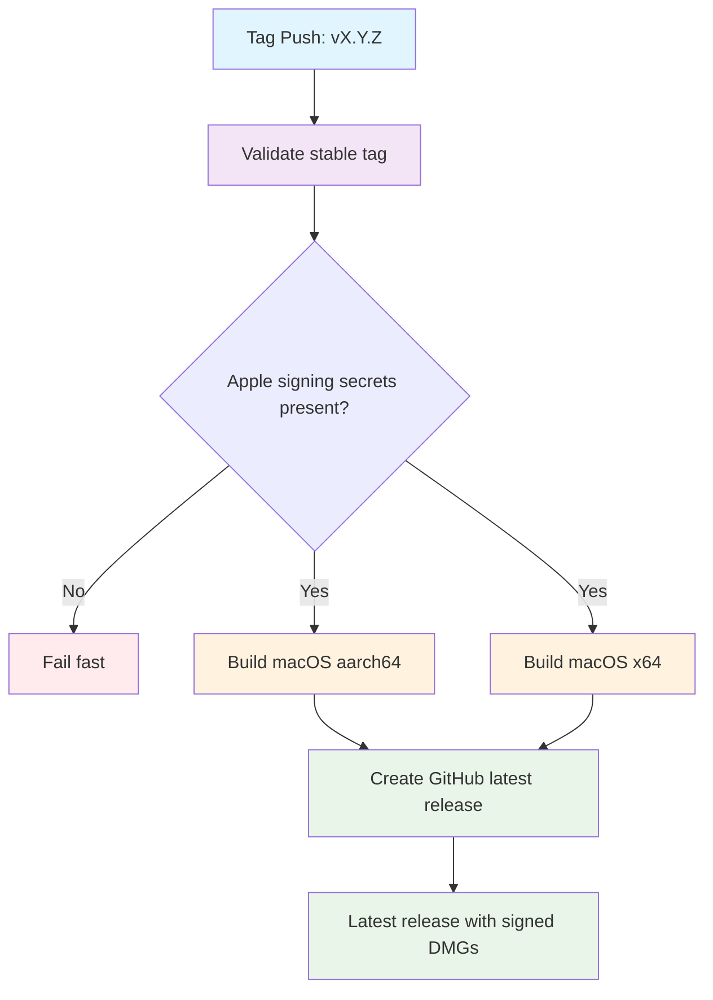

## Workflow Overview

**Purpose**: Build signed and notarized macOS Tauri installers for ARM64 and Intel, then publish them as the GitHub latest (non-prerelease) release for a stable version tag.
**Trigger Events**: Push of a stable semantic version tag (`vX.Y.Z` with no prerelease suffix)
**Target Environments**: macOS (aarch64 + x86_64) production distribution via GitHub Releases

This workflow is the GA counterpart of [Pre-Publish (Beta)](./spec-process-cicd-pre-publish.md). Beta tags must never enter this path.

## Execution Flow Diagram



## Jobs & Dependencies

| Job Name | Purpose | Dependencies | Execution Context |
|----------|---------|--------------|-------------------|
| validate | Extract version; reject beta/rc/alpha and non-semver tags | none | ubuntu-latest |
| build-macos (x2) | Typecheck, sign, notarize, and package DMG per arch | validate | macos-latest (matrix) |
| create-release | Publish GitHub latest release with both DMGs + checksums | validate, build-macos | ubuntu-latest |

## Requirements Matrix

### Functional Requirements

| ID | Requirement | Priority | Acceptance Criteria |
|----|-------------|----------|-------------------|
| REQ-001 | Tag must be exact `vX.Y.Z` (no suffix) | High | Rejects `v1.0.1-beta.1`, `v1.0.1-rc.1`, `v1.0.1-alpha.1`, `v1.0` |
| REQ-002 | Beta tags never run this workflow | High | `v*-beta*` is excluded at trigger and at validate |
| REQ-003 | Build DMG for Apple Silicon (aarch64) | High | Valid signed DMG artifact `Poria-{VERSION}-aarch64.dmg` |
| REQ-004 | Build DMG for Intel (x86_64) | High | Valid signed DMG artifact `Poria-{VERSION}-x64.dmg` |
| REQ-005 | Version synced into all build configs | High | `tauri.conf.json`, `src-tauri/Cargo.toml`, `package.json` match tag version |
| REQ-006 | GitHub **latest** release (not prerelease) | High | Release is not marked prerelease; becomes latest for the repo |
| REQ-007 | Frontend typechecked before bundle | Medium | Frontend typecheck passes |
| REQ-008 | Cargo workspace + desktop binary compile | High | Both matrix legs produce a DMG |
| REQ-009 | Apple Developer signing is mandatory | High | Missing certificate fails the job; no ad-hoc fallback |
| REQ-010 | Apple notarization is mandatory | High | Missing notarization identity fails the job |
| REQ-011 | Release notes omit beta/xattr workaround | High | Notes describe a signed, notarized install path |
| REQ-012 | SHA-256 of both DMGs published | Medium | Checksums in release notes and/or assets |

### Security Requirements

| ID | Requirement | Implementation Constraint |
|----|-------------|---------------------------|
| SEC-001 | Apple signing identity required | Certificate stored as encrypted repository/org secret; never ad-hoc for GA |
| SEC-002 | Notarization identity required | Apple ID, app-specific password, and team ID must all be present |
| SEC-003 | Tauri updater signing key | Private key from secrets when updater is enabled |
| SEC-004 | Contents write only | Workflow token limited to creating/updating the release for that tag |
| SEC-005 | No secret leakage | Secrets never echoed; artifacts are installers only |

### Performance Requirements

| ID | Metric | Target | Measurement Method |
|----|--------|--------|--------------------|
| PERF-001 | Validate duration | ≤ 5 min | Job timeout |
| PERF-002 | Per-arch build duration | ≤ 30 min | Job timeout |
| PERF-003 | Release publish duration | ≤ 10 min | Job timeout |
| PERF-004 | End-to-end | Both arch jobs in parallel; total wall clock ≈ one build | GitHub Actions run timeline |

## Input/Output Contracts

### Inputs

```yaml
# Repository Triggers
tags:
  include: v*.*.*          # Candidate stable tags
  exclude: v*-beta*, v*-rc*, v*-alpha*

# Environment Constants
NODE_VERSION: pinned Node 24.20.x
PNPM_VERSION: pinned pnpm 11.23.x

# Derived
TAG: github.ref without refs/tags/
VERSION: TAG without leading v  # must match X.Y.Z
```

### Outputs

```yaml
# Job outputs (validate)
version: string   # e.g. 1.0.1
tag: string       # e.g. v1.0.1

# Build artifacts (7-day retention, then attached to the release)
Poria-{VERSION}-aarch64.dmg: file
Poria-{VERSION}-x64.dmg: file

# GitHub Release
kind: latest (not prerelease)
title: Poria Desktop {VERSION}
assets: both DMGs
notes: download table, signed-install steps, SHA-256
```

### Secrets & Variables

| Type | Name | Purpose | Scope | Required |
|------|------|---------|-------|----------|
| Secret | APPLE_CERTIFICATE | Code signing identity (base64 p12) | Workflow | Yes |
| Secret | APPLE_CERTIFICATE_PASSWORD | P12 passphrase | Workflow | Yes |
| Secret | APPLE_ID | Notarization Apple ID | Workflow | Yes |
| Secret | APPLE_PASSWORD | Notarization app-specific password | Workflow | Yes |
| Secret | APPLE_TEAM_ID | Team ID for notarization | Workflow | Yes |
| Secret | TAURI_SIGNING_PRIVATE_KEY | Tauri updater signing | Workflow | Optional |
| Token | github.token | Create GitHub release | Workflow | Yes (default) |

## Execution Constraints

### Runtime Constraints

- **Timeout**: 5 min (validate), 30 min (build), 10 min (release)
- **Concurrency**: One run per tag ref; cancel in-progress retries of the same tag
- **Permissions**: `contents: write` for release creation
- **Fail-fast (matrix)**: false — one arch failure must not hide the other arch’s logs

### Environmental Constraints

- **Runner**: Linux for validate/release; macOS for both architecture builds
- **Network**: crates.io, npm registry, Apple notarization service, GitHub Releases API
- **Project layout**: Cargo workspace at repo root; Tauri in `src-tauri/`; frontend at `src/`
- **No `apps/desktop/` nesting**

### Build Steps (per arch)

1. Checkout the tag
2. Activate pinned Node + pnpm
3. Install Rust toolchain with the matrix target
4. Cache Cargo registry/git + workspace `target`
5. Install Tauri CLI
6. Sync `VERSION` into `src-tauri/tauri.conf.json`, `src-tauri/Cargo.toml`, `package.json`
7. Install frontend deps from lockfile
8. Frontend typecheck
9. Import Apple signing identity (required)
10. Bundle with notarization environment present (required)
11. Copy produced DMG to `Poria-{VERSION}-{arch}.dmg`
12. Reject DMG smaller than 1 MB
13. Upload artifact

## Error Handling Strategy

| Error Type | Response | Recovery Action |
|------------|----------|-----------------|
| Invalid or prerelease tag | Fail validate | Do not publish; use beta workflow or retag `vX.Y.Z` |
| Missing Apple signing/notarization secrets | Fail build before bundle | Configure org/repo secrets; re-run |
| Typecheck failure | Fail build | Fix TypeScript; move tag or push a new patch tag |
| Rust compilation error | Fail build | Fix crates; new tag |
| Notarization rejected | Fail build | Inspect Apple notarization log; fix entitlements/signing |
| DMG too small (<1 MB) | Fail build | Inspect bundle output |
| One arch fails, other succeeds | Release job blocked | Fix failed arch; re-run workflow |
| Duplicate GitHub release for tag | Fail release | Delete or reuse existing release only via explicit operator action |
| Beta tag accidentally matching glob | Validate rejects; trigger exclusion should prevent start | Keep exclude filters + regex |

## Quality Gates

### Gate Definitions

| Gate | Criteria | Bypass Conditions |
|------|----------|-------------------|
| Tag format | `^v?[0-9]+\.[0-9]+\.[0-9]+$` after stripping `v` | None |
| Not a prerelease tag | No `-beta` / `-rc` / `-alpha` / other `-` suffix | None |
| TypeScript | Frontend typecheck passes | None |
| Rust + Tauri bundle | Both matrix targets succeed | None |
| Apple identity | Signing + notarization secrets non-empty | None |
| DMG size | > 1 MB | None |
| Release kind | Latest, not prerelease | None |

## Monitoring & Observability

### Key Metrics

- **Success Rate**: 100% of valid stable tags should produce a latest release
- **Execution Time**: < 30 min per architecture
- **Artifact Size**: DMG typically 10–100 MB
- **Release freshness**: Published release tag equals the triggering tag

### Alerting

| Condition | Severity | Notification Target |
|-----------|----------|---------------------|
| Validate or build failure on a stable tag | High | Repository Actions UI; release owner |
| Missing Apple secrets | High | Secret administrators |
| Notarization failure | High | macOS signing owner |

## Integration Points

### External Systems

| System | Integration Type | Data Exchange | SLA Requirements |
|--------|------------------|---------------|------------------|
| GitHub Releases | Publish | DMG assets + notes | Tag-triggered; idempotent per tag |
| Apple Developer / notary | Sign + notarize | Signed app bundle | Must succeed before GA publish |
| npm / crates.io | Build-time fetch | Lockfile-pinned deps | Frozen lockfile |

### Dependent Workflows

| Workflow | Relationship | Trigger Mechanism |
|----------|--------------|-------------------|
| Pre-Publish (Beta) | Sibling; never same tag | `v*-beta*` tags only |
| This workflow | GA | `vX.Y.Z` tags only |

## Compliance & Governance

### Audit Requirements

- **Execution logs**: GitHub Actions retention (default)
- **Release assets**: Remain on the GitHub release until manually deleted
- **Approval**: Tag push to the default protected branch is the human gate; workflow itself is automatic after a valid tag
- **Change control**: Update this spec before changing the workflow file

### Security Controls

- **Access control**: Only maintainers who can push tags to the default branch can start GA
- **Secret management**: Apple and updater keys live in GitHub Secrets; rotate with the Apple team
- **Vulnerability scanning**: Not in this workflow’s scope (separate CI)

## Edge Cases & Exceptions

### Scenario Matrix

| Scenario | Expected Behavior | Validation Method |
|----------|-------------------|-------------------|
| Tag `v1.0.1-beta.15` | This workflow does not run (or validate fails) | Trigger exclude + regex |
| Tag `v1.0.1` on main | Builds from that tag; latest GitHub release | Release URL and assets |
| Tag `v1.0.1` while a beta release exists | GA is latest; beta remains prerelease | GitHub latest points at GA |
| Missing `APPLE_CERTIFICATE` | Job fails; no unsigned GA DMG | Actions log |
| Tag not on main | Still builds the tagged commit | Operators should tag main |
| Concurrent tags | Isolated by ref concurrency group | One run per tag |
| Re-run of the same tag | Cancels in-progress duplicate; may fail if release already exists | Operator deletes or uses a patch tag |
| Cargo.lock drift | Frozen install / compile fails | Keep lockfile committed |

## Validation Criteria

### Workflow Validation

- **VLD-001**: Only tags matching exact `vX.Y.Z` produce a latest release
- **VLD-002**: `v*-beta*` continues to use the beta pre-publish workflow exclusively
- **VLD-003**: Both architecture DMGs are attached
- **VLD-004**: Release is not marked prerelease
- **VLD-005**: Notes include SHA-256 and a signed-install path (no `xattr -cr` as the primary instruction)
- **VLD-006**: Version in bundle metadata equals the tag version
- **VLD-007**: Unsigned/ad-hoc GA artifacts are never published

### Performance Benchmarks

- **PERF-001**: Validate job completes within 5 minutes
- **PERF-002**: Each macOS matrix job completes within 30 minutes
- **PERF-003**: Release job completes within 10 minutes after both builds

## Change Management

### Update Process

1. **Specification Update**: Modify this document first
2. **Review & Approval**: Maintainer review of spec + workflow diff
3. **Implementation**: Apply changes to `.github/workflows/publish.yml`
4. **Testing**: Dry-run on a throwaway `v0.0.0` patch tag only if secrets are available; otherwise validate job unit via a rejected tag
5. **Deployment**: Merged workflow is live for the next stable tag

### Version History

| Version | Date | Changes | Author |
|---------|------|---------|--------|
| 1.0 | 2026-09-17 | Initial GA publish specification | heyongqi10 |

## Related Specifications

- [Pre-Publish (Beta)](./spec-process-cicd-pre-publish.md) — prerelease path for `vX.Y.Z-beta.N`
- `AGENTS.md` — local toolchain pins (Node 24.20.0, pnpm 11.23.0) and beta tag recipe
