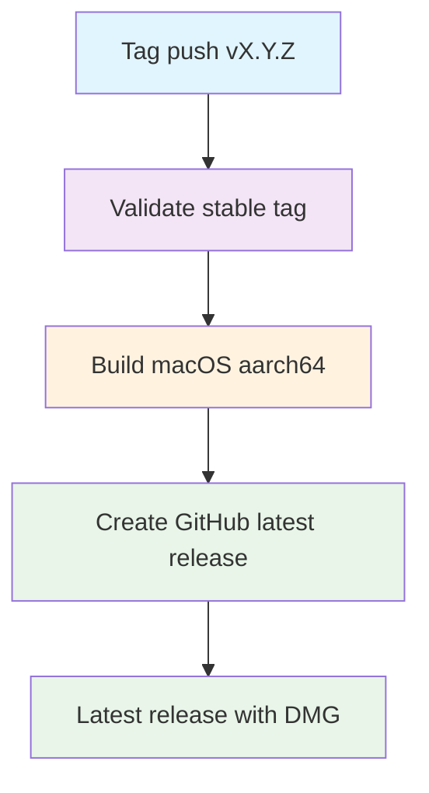

## Workflow overview

**Purpose**: On a stable version tag, build one Apple Silicon macOS DMG and publish it as the GitHub **latest** (non-prerelease) release.
**Trigger**: Push of `v*.*.*` excluding `v*-beta*`, `v*-rc*`, `v*-alpha*`.
**Target**: macOS `aarch64-apple-darwin` distribution only.

Sibling: [Pre-Publish (Beta)](./spec-process-cicd-pre-publish.md). Beta tags must never enter this path.

## Execution flow

## Jobs and dependencies

| Job | Purpose | Depends on | Runner |
| --- | --- | --- | --- |
| validate | Accept only `vX.Y.Z`; emit `tag` and `version` | none | ubuntu-latest |
| build-macos | Typecheck, bundle, sign or ad-hoc, package DMG | validate | macos-latest, matrix arch `aarch64` |
| create-release | Latest release with DMG, SHA-256, install notes | validate, build-macos | ubuntu-latest |

## Requirements

| ID | Requirement | Priority | Acceptance |
| --- | --- | --- | --- |
| REQ-001 | Tag is exact `vX.Y.Z` | High | Reject prerelease suffixes and `v1.0` |
| REQ-002 | Trigger excludes beta, rc, alpha | High | Those tags never start this workflow |
| REQ-003 | One Apple Silicon DMG | High | Asset `Poria-{VERSION}-aarch64.dmg` |
| REQ-004 | Do not build Intel | High | Matrix has no `x86_64-apple-darwin` |
| REQ-005 | Sync tag version into bundle metadata | High | `tauri.conf.json`, `src-tauri/Cargo.toml`, `package.json` equal `VERSION` |
| REQ-006 | GitHub latest, not prerelease | High | `--latest`; existing betas stay prerelease |
| REQ-007 | Frontend typecheck before bundle | Medium | Typecheck job step passes |
| REQ-008 | Missing Apple certificate still yields a DMG | High | Ad-hoc sign; notes mention `xattr -cr` |
| REQ-009 | DMG larger than 1 MB | High | Smaller file fails the build |
| REQ-010 | SHA-256 in notes | Medium | Checksums listed |

### Security

| ID | Constraint |
| --- | --- |
| SEC-001 | Apple certificate, notarization identity, and Tauri updater key are optional secrets |
| SEC-002 | `contents: write` only; do not echo secrets |
| SEC-003 | Artifacts are installers only |

### Performance

| ID | Metric | Target |
| --- | --- | --- |
| PERF-001 | Validate timeout | 5 min |
| PERF-002 | Build timeout | 30 min |
| PERF-003 | Release timeout | 10 min |

## Input and output

**Inputs**

- Include: `v*.*.*`. Exclude: `v*-beta*`, `v*-rc*`, `v*-alpha*`.
- Pins: Node `24.20.0`, pnpm `11.23.0`.
- Derived: `VERSION` must match `^[0-9]+\.[0-9]+\.[0-9]+$`.

**Outputs**

- Job: `version`, `tag`
- Artifact: `Poria-{VERSION}-aarch64.dmg`
- GitHub release title `Poria Desktop {VERSION}`, marked latest

**Secrets**: same optional Apple / Tauri names as the beta workflow; `github.token` for `gh release create`.

## Execution constraints

- Concurrency: one run per tag ref; cancel in-progress retries of the same tag.
- Shared toolchain: [Setup macOS Tauri](./spec-process-cicd-setup-macos-tauri.md) with `save-cache: false`.
- Workflow file on the **tagged commit** is what runs.

## Error handling

| Error | Response | Recovery |
| --- | --- | --- |
| `v1.0.1-beta.1` or `v1.0.1-rc.1` | Do not start, or fail validate | Use the beta workflow or a stable tag |
| Typecheck or compile failure | Fail build | New patch tag after the fix |
| Empty Apple certificate | Ad-hoc sign, still publish as latest | Configure secrets later |
| Notarization rejected when identity is set | Fail build | Inspect Apple log |
| Duplicate GitHub release for the tag | Fail release | Operator deletes the release or uses a new tag |

## Quality gates

| Gate | Bypass |
| --- | --- |
| Tag regex `^[0-9]+\.[0-9]+\.[0-9]+$` after stripping `v` | None |
| Frontend typecheck | None |
| Tauri bundle for `aarch64-apple-darwin` | None |
| Apple identity | Skip; ad-hoc |
| DMG &gt; 1 MB | None |
| Release is latest, not prerelease | None |

## Edge cases

| Scenario | Expected behavior |
| --- | --- |
| `v1.2.3-beta.1` | This workflow does not start |
| Stable tag while a beta release exists | This release becomes latest; beta stays prerelease |
| Tag not on `main` | Builds the tagged commit |

## Related

- Implementation: `.github/workflows/publish.yml`
- [Pre-Publish (Beta)](./spec-process-cicd-pre-publish.md)
- [Warm Rust cache](./spec-process-cicd-warm-rust-cache.md)
- [Setup macOS Tauri](./spec-process-cicd-setup-macos-tauri.md)
