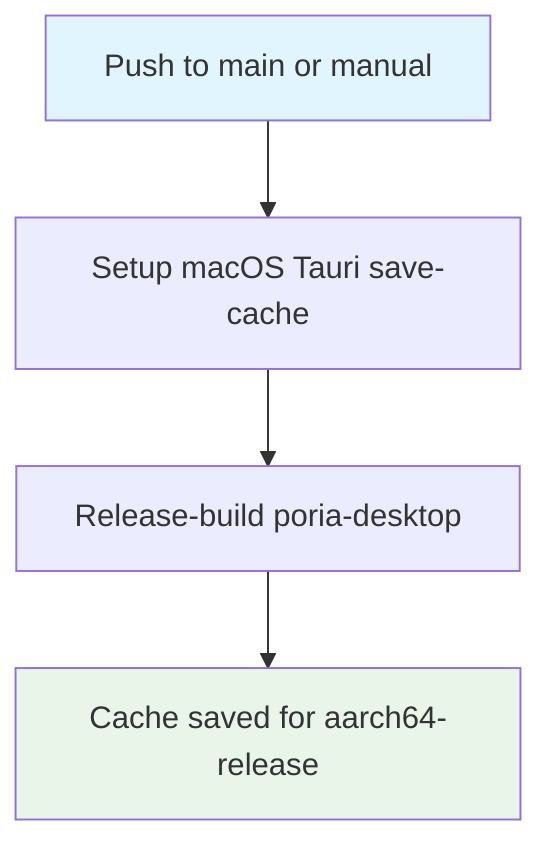

## Workflow overview

**Purpose**: On `main`, compile the Apple Silicon release `poria-desktop` crate so tag-only publish jobs can restore a Cargo target cache. Tag runs cannot save caches keyed from previous tags.
**Trigger**: Push to `main` when Rust or the macOS Tauri composite action changes; also `workflow_dispatch`.
**Target**: `aarch64-apple-darwin` release build on `macos-latest`.

## Execution flow

## Jobs and dependencies

| Job  | Purpose                                                                    | Depends on | Runner       |
| ---- | -------------------------------------------------------------------------- | ---------- | ------------ |
| warm | Install toolchain, save cache, `cargo build --release` for `poria-desktop` | none       | macos-latest |

Path filters (all must be in the workflow `on.push.paths`): `Cargo.lock`, `Cargo.toml`, `crates/**`, `src-tauri/**`, `.github/actions/setup-macos-tauri/**`, `.github/workflows/warm-rust-cache.yml`.

## Requirements

| ID      | Requirement                      | Priority | Acceptance                                              |
| ------- | -------------------------------- | -------- | ------------------------------------------------------- |
| REQ-001 | Save Cargo cache                 | High     | Composite `save-cache: true`                            |
| REQ-002 | Do not install Tauri CLI         | High     | Composite `install-cli: false`                          |
| REQ-003 | Release-build desktop crate only | High     | `-p poria-desktop` for `aarch64-apple-darwin`           |
| REQ-004 | Read-only contents               | High     | `permissions.contents: read`                            |
| REQ-005 | Single flight                    | Medium   | Concurrency group `warm-rust-cache`, cancel in-progress |

## Execution constraints

- Timeout: 30 min.
- Shared action: [Setup macOS Tauri](./spec-process-cicd-setup-macos-tauri.md).
- No Node, pnpm, DMG, or GitHub Release.

## Error handling

| Error                    | Response                                     | Recovery             |
| ------------------------ | -------------------------------------------- | -------------------- |
| Compile failure          | Fail the job; publish still can cold-compile | Fix crates on `main` |
| Cache backend miss later | Publish jobs still succeed, slower           | Re-run this workflow |

## Related

- Implementation: `.github/workflows/warm-rust-cache.yml`
- Consumers: [Pre-Publish](./spec-process-cicd-pre-publish.md), [Publish](./spec-process-cicd-publish.md)
